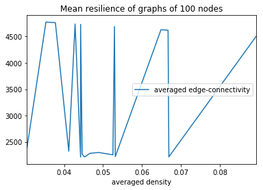

Random-Attack Resilience of Random and Geometric Graphs
=======================================================

(C) 2018 Jan Kumor, Patryk Kocielnik, Warsaw University of Technology

## Usage

Type what comes below in the Jupyter Notebook.

```python
%matplotlib inline

e = resiliences.experiment(
            vertex_count = 10^2,
            edge_density = 10^-1,
            edge_distribution = "random"
        )

e.save_plot("plot.svg")

```

When routine finishes, collect the plot from the execution directory.

## Back-end details

The class with experimental methods is `src/resiliences.py`.

The main notebook for the experiment is `src/report.ipynb`.

To run the notebook you need Jupyter Notebook (formerly iPython Notebook). Install with `pip install jupyter`.

The report (the deliverable) is in the main directory of the project in the PDF file named `report.pdf`.

To generate the report from files located in directory `in` where the report draft is located, issue the `make` command while in the project root directory.

## Results

Correct results in the graph below is what we are after. Then we need to aggregate similar results for varying graph sizes and connectivity factors (densities, `k`).



The curve should grow with the horizontal variable, but it is yet unknown, at what proportion (if at *any* proportion at all, vide the notion of *scale-free nets*).

## Project structure

Directory tree:

- `workshop` - Data needed to generate the deliverables (the project engine),
  - `contract` - Requirements for the project,
  - `in` - Source text of the report,
  - `out` - Destination for the generated report,
  - `src` - Source code of the experiment (a Python class + sauce & spinach).

## Report

The report is generated from Markdown.

This approach saves a lot of lots in terms of generation time. To withess this miracle, say `cd workshop` and then `make`.

## Schedule

| Data       | Zadanie                                                                                                    |
|------------|------------------------------------------------------------------------------------------------------------|
| 06.04.2018 | Sprawozdanie nr 1: uszczegółowiony opis zadania (wymagane uprzednie konsultacje z prowadzącym)             |
| 07.05.2018 | Sprawozdanie nr 2: wybór i opis algorytmu, struktur danych, projekty testów, założenia programu (10 pkt.)  |
| 28.05.2018 | Sprawozdanie nr 3: program z udokumentowany kodem, wyniki testów poprawności i jakości algorytmów, wnioski |
| 08.06.2018 | Zaliczenie projektu u prowadzącego (20 pkt.)                                                               |

## Rules

> W przypadku sprawozdań spóźnionych system automatycznie naliczy karę w wymiarze 10% punktów/dzień.

> Poprawie nie podlegają sprawozdania spóźnione ani takie, w stosunku do których zachodzi podejrzenie, że zostały załadowane do systemu wyłącznie w celu uniknięcia kary za spóźnienie. W tym drugim przypadku wobec Autorów mogą zostać wyciągnięte dodatkowe konsekwencje. Tryb ewentualnej poprawy sprawozdania należy ustalać indywidualnie ze sprawdzającym.

## Similar projects

1. [NetSwan: A set of functions for studying network robustness, resilience and vulnerability](https://cran.r-project.org/web/packages/NetSwan/NetSwan.pdf)
2. [CyGraph: Big-Data Graph Analysis For Cybersecurity and Mission Resilience](https://resources.sei.cmu.edu/library/asset-view.cfm?assetid=512156)

## Todo

1. Gather results for $n$ from range [10 .. 100 000] and densities of [0.001 .. 1]
1. Use `multiprocessing` lib to speed up computations.
