# SK21. Atak na sieć (II)

## Raport nr 3 do projektu w ramach kursu "Grafy i Sieci" (GIS) 

### Patryk Kocielnik, Jan Kumor, 28.05.2018r.

---

## Opiekun projektu
dr inż. Sebastian Kozłowski

## Opis zadania

Dane są dwie sieci: euklidesowa i losowa (ER) o mniej więcej takiej samej
liczbie wierzchołków i krawędzi. Porównać prawdopodobieństwa powodzenia ataku na
losowe krawędzie tych sieci (udany atak to taki, który prowadzi do rozspójnienia
sieci).

## Errata do sprawozdania nr 1

Oryginalny tekst sprawozdania nr 1 i 2 zawierają odpowiednio ZAŁĄCZNIK 1 oraz
ZAŁĄCZNIK 2.

### I.

Zmianie ulega brzmienie sekcji "Generowanie grafów" raportu drugiego i otrzymuje następujące
brzmienie:

## Generowanie grafów

### Wyniki eksperymentu

Eksperyment przeprowadzony został zgodnie z ustaleniami opisanymi w poprzednich sprawozdaniach z uwzględnieniem poprawek zawartych w Erracie.

W każdym z przebiegów generowana była populacja grafów o zadanej wielkości i gęstości. Liczba usuniętych krawędzi, która spowodowała rozspójnienie grafu, została następnie uśredniona i umieszczona na odpowiednim wykresie.

#### Graf o 10 wierzchołkach

Liczba wierzchołków | Sieć euklidesowa                  |  Sieć Erdosa-Renyi
:------------------:|:---------------------------------:|:--------------------------------:
 20                 | 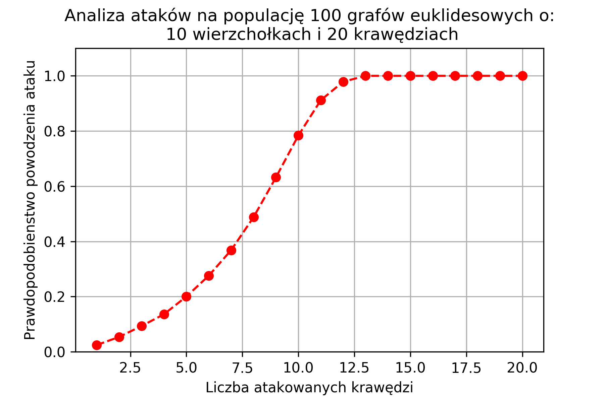  | 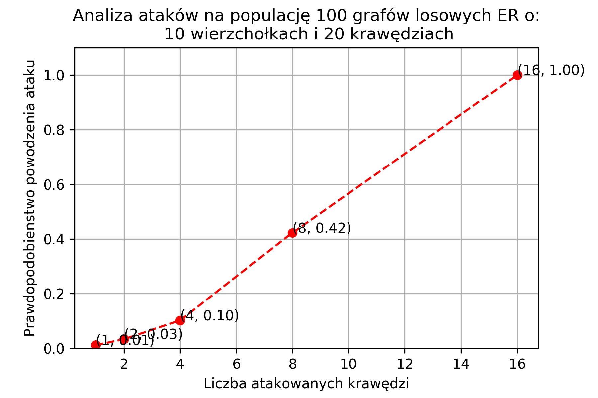
 30                 | 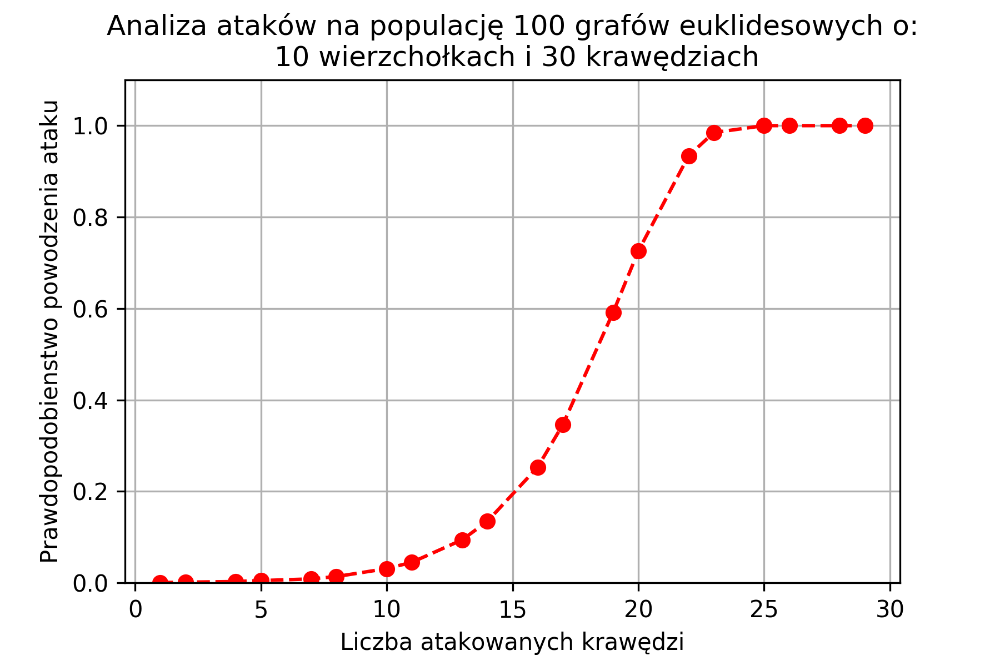  | 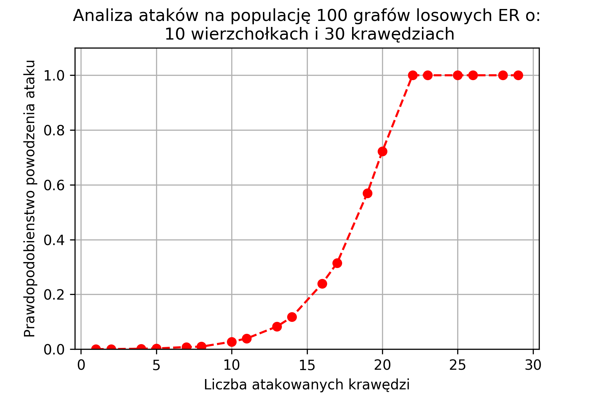
 40                 | 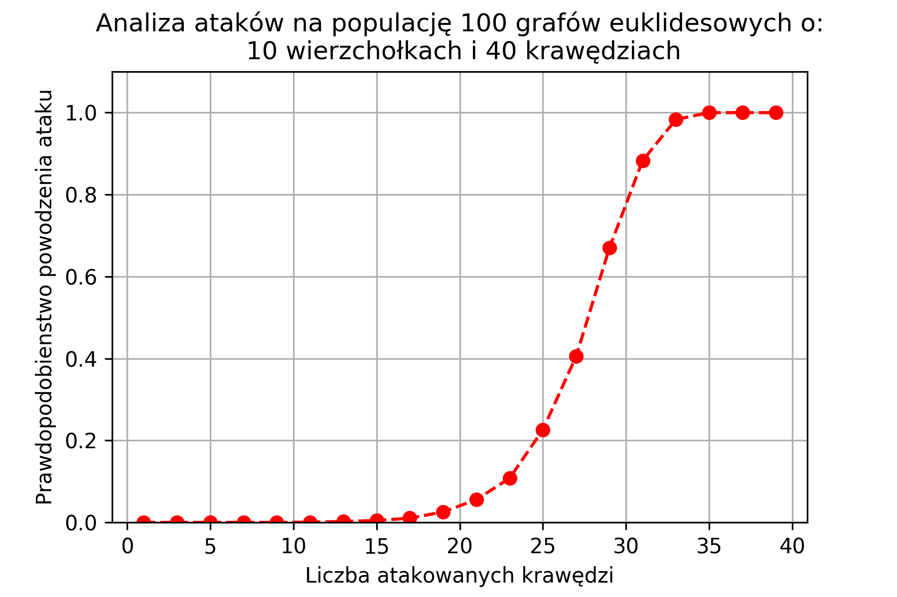  | 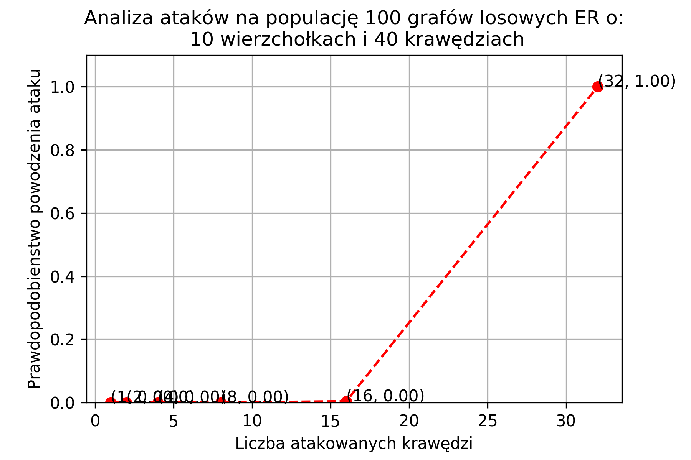

#### Graf o 100 wierzchołkach

Liczba wierzchołków | Sieć euklidesowa                     |  Sieć Erdosa-Renyi
:------------------:|:------------------------------------:|:--------------------------------:
 200                | 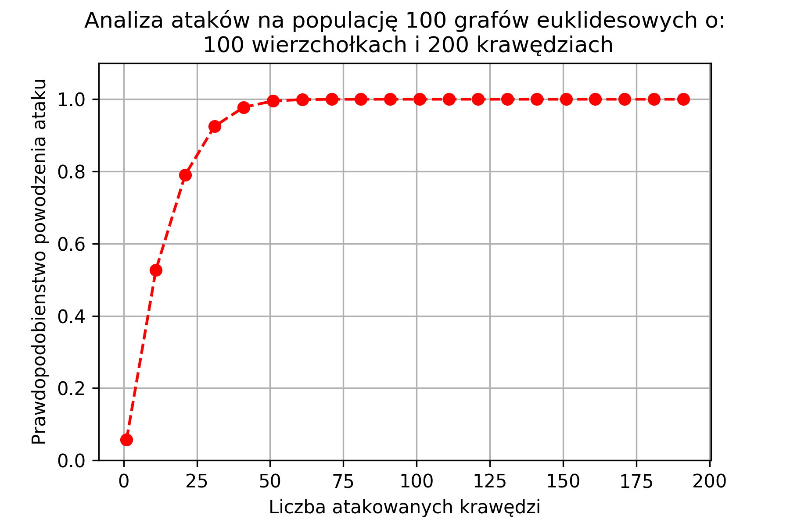   | 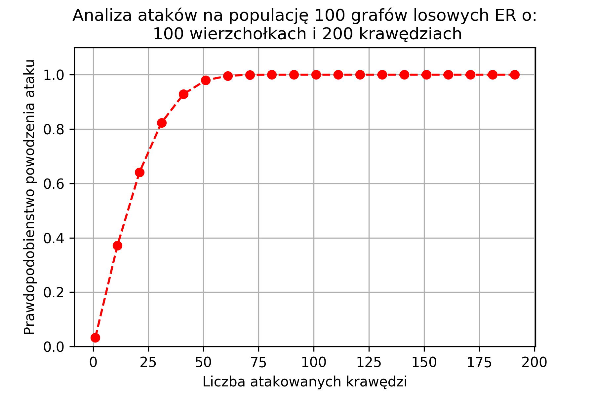
 800                | 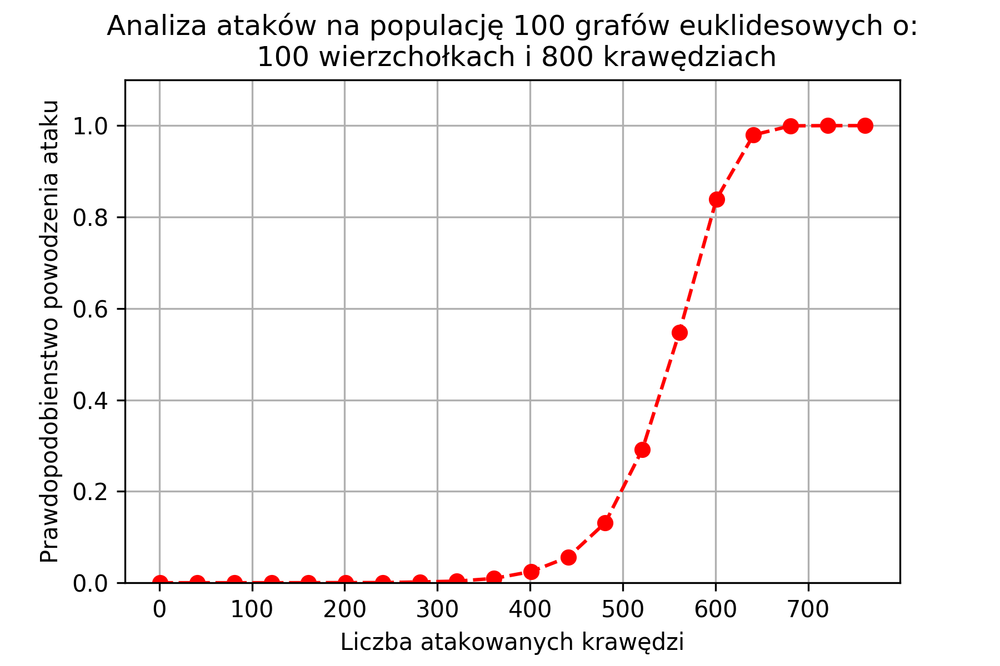   | 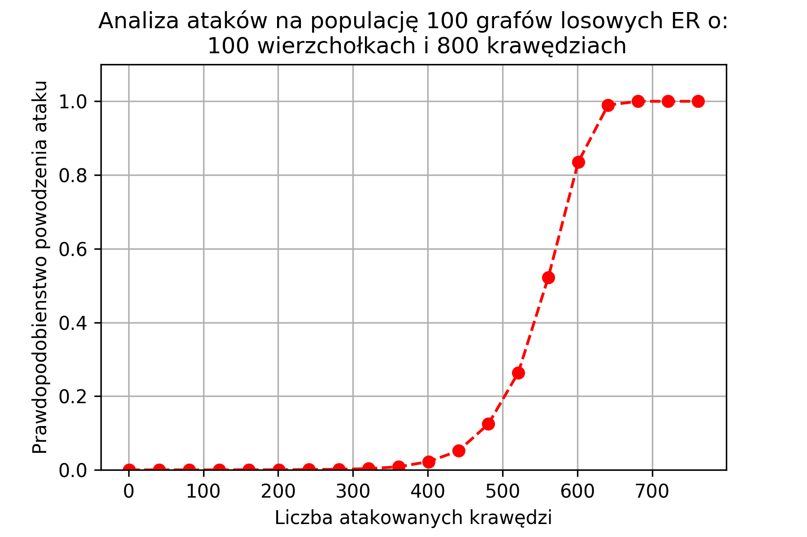
 1600               | 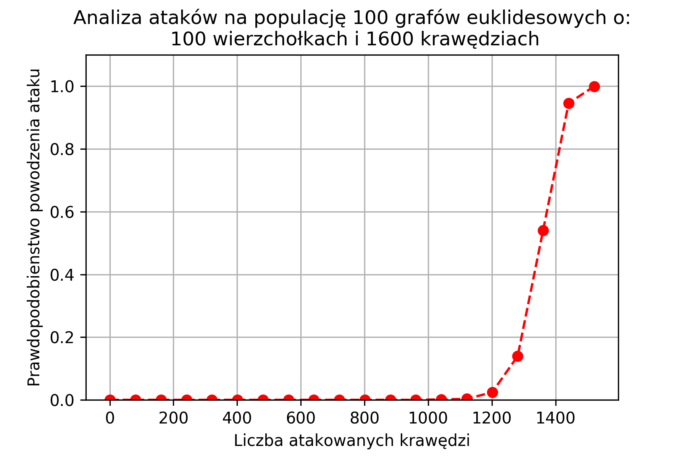  | 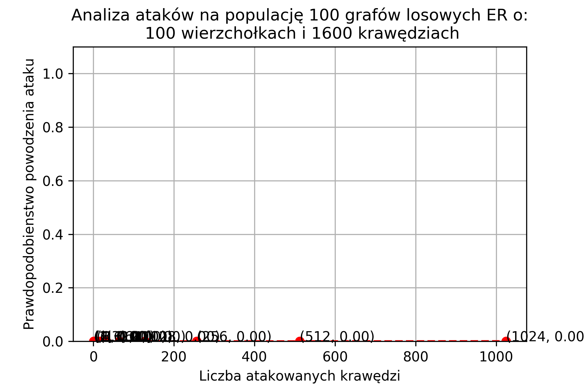
 
#### Graf o 1000 wierzchołków

Liczba wierzchołków | Sieć euklidesowa                     |  Sieć Erdosa-Renyi
:------------------:|:------------------------------------:|:--------------------------------:
 200                |    | 
 800                |    | 
 1600               |   | 

## Wnioski

Na podstawie niniejszych badań sformułowano wnioski, które przedstawione są poniżej.

Dane eksperymentalne wykazały, że łatwiej rozspójnić graf Euklidesowy niż Erdosa-Renyi (ER) losowymi atakami na krawędzie.

Wynik ten jest zgodny z teorią ujętą w książce "Grafy i sieci" \[1\] w podrozdziale 17.5. Autor książki wskazuje, że graf Euklidesowy składa się z wielu spójnych podgrafów połączonych ze sobą mostami, co czyni go wrażliwym na ataki na owe krawędzie.

Jedną z pobocznych obeserwacji związanych z eksperymentem jest to, iż dla grafów złożonych z dziesięciu i więcej wierzchołków wykres zależności podatności na rozspójnienie od liczby atakowanych krawędzi posiada kształt wyraźnie różny od tego dla większych grafów, przypominający kształtem funkcję $f(x) = 1/x$. Nie obserwujemy w tych mniejszych zatem jeszcze własności sieci wielkoskalowych, które pojawiają się w grafach o 100 i więcej wierzchołkach.

## Bibliografia

- [\[1\] Grafy i sieci, Jacek Wojciechowski, Krzysztof Pieńkosz, PWN, Warszawa 2013](http://igraph.org/c/doc/)

\pagebreak
## ZAŁĄCZNIK 1: Oryginalna treść sprawozdania nr 1

# SK6. Atak na sieć (II)

## Raport nr 2 do projektu w ramach kursu "Grafy i Sieci" (GIS) 

### Patryk Kocielnik, Jan Kumor, 07.05.2018r. (tekst ujednolicony)

---

## Opiekun projektu
dr inż. Sebastian Kozłowski

## Opis zadania

Dane są dwie sieci: euklidesowa i losowa (ER) o mniej więcej takiej samej
liczbie wierzchołków i krawędzi. Porównać prawdopodobieństwa powodzenia ataku na
losowe krawędzie tych sieci (udany atak to taki, który prowadzi do rozspójnienia
sieci).

## Planowane wykorzystanie narzędzi w projekcie

- Środowisko rozwiązania: stacja robocza pod kontrolą systemu GNU/Linux,
- Język implementacji rozwiązania: Python,
- Narzędzia do analizy i wizualizacji grafów: 
  - _igraph_ - bilbioteka języka C [\[1\]](http://igraph.org/c/doc/),
  - _python-igraph_ interfejs programistyczny biblioteki _igraph_ dla języka
  Python [\[2\]](http://igraph.org/python/doc/igraph-module.html),


## Składniki rozwiązania

1. Moduł generacji sieci: euklidesowych oraz losowych, o zadanej liczbie
wierzchołków:
   - Sposób wywołania: `graph = generate_graph(graph_type, vertices, edges)`,
   - Rezultat wywołania: obiekt typu `Graph` z pakietu _igraph_,
   - Podstawą komponentu będą moduły generowania sieci z pakietu _igraph_ -
funkcje `Erdos_Renyi` (dla grafów losowych) oraz `GRG` (dla grafów
euklidesowych) należące do klasy `Graph`.
2. Filtr usuwający z grafu wybraną krawędź:
   - Sposób wywołania: `new_graph = break(graph, edge)`.
   - Rezultat wywołania: `new_graph` jako graf pozbawiony wybranej krawędzi.
3. Analizator spójności sieci:
   - Sposób wywołania: `c = is_connected(graph)`
   - Rezultat wywołania: $c$ (`bool`) flaga przyjmująca wartość `True` jeśli
   graf jest spójny, przeciwnie`False`.
4. Moduł analizy ataku na zadany graf:
   - Sposób wywołania: `p = analyse_attack(graph)`,
   - Rezultat wywołania: $p$ (`float`) jako prawdopodobieństwo powodzenia ataku
   na losowo wybraną krawędź zadanego grafu wejściowego,
   - Moduł przeprowadza próby ataku na każdą z krawędzi grafu i na podstawie ich
   wyników oblicza prawdopodobieństwo powodzenia.

## Interfejs aplikacji

Interfejsem aplikacji będzie konsola tekstowa. Motywacją tego podejścia jest
łatwość łączenia aplikacji z interfejsem tekstowym w filtry, które później
wykorzystać można do analizy bardziej złożonych struktur.

## Przebieg eksperymentu

Zdefiniowane zostaną następujące zestawy parametrów:
- Typ grafu - euklidesowy lub losowy ER, 
- Liczba generowanych grafów $k$ - proponowana wartość w granicach od 100 do 1000,
- Liczba wierzchołków grafu $n$ - przyjmująca jedną z wartości: 10, 100, 1000, 4000,
- Liczba krawędzi grafu $m$ - przyjmująca logiczne wartości w zależności od $n$.

Następnie przeprowadzona zostanie analiza zgodnie z następującym algorytmem:
 
1. Z uprzednio zdefiniowanej listy zostanie przyjęty zestaw parametrów testu,
2. Wygenerowany zostanie zestaw $k$ grafów testowych o przyjętych wcześniej
parametrach,
3. Dla każdego z grafów:
   1. Dla każdej z krawędzi badanego grafu:
      1. Krawędź ta zostanie usunięta z grafu (zostanie przeprowadzony atak na
      tę krawędź),
      2. Sprawdzona zostanie spójność grafu po przeprowadzeniu ataku,
      3. Jeśli graf nie jest spójny atak zakończył się powodzeniem,
   2. Obliczone zostanie prawdopodobieństwo powodzenia ataku na losowo wybraną
   krawędź z badanego grafu, zgodnie ze wzorem: $p_i = \frac{n_{sukces}}{m}$
4. Zgodnie ze wzorem: $p_{sr} = \frac{\sum_{i=0}^{k} p_i}{k}$, zostanie
obliczone średnie prawdopodobieństwo powodzenia ataku dla zestawu $k$ grafów
testowych o przyjętych parametrach.
5. Jeśli pozostały nieprzetestowane zestawy parametrów, nastąpi powrót do
punktu 1.

## Generowanie grafów

Grafy losowe ER (model Erdős–Rényi) zostaną wygenerowane z użyciem funkcji 
`Erdos_Renyi` klasy `Graph` pakietu _igraph_. Metoda ta przyjmuje jako parametry:
- liczbę wierzchołków grafu $n$
- prawdopodobieństwo wystąpienia danej krawędzi $p$ lub zadaną liczbę krawędzi
$m$.

Zgodnie z dokumentacją pakietu _igraph_ algorytm wykorzystywany w metodzie
`Erdos_Renyi` ma złożoność obliczeniową równą $O(|V|+|E|)$
[\[1\]](http://igraph.org/c/doc/).

Grafy euklidesowe zostaną wygenerowane z wykorzystaniem funkcji `GRG` klasy 
`Graph` z pakietu _igraph_. Metoda ta przyjmuje jako parametry:
 - liczbę wierzchołków grafu $n$
 - promień $r$.
 
 Algorytm generacji grafu euklidesowego o $n$ wierzchołkach:

1. Rozmieść $n$ wierzchołków w kwadracie jednostkowym,
2. Połącz krawędziami te wierzchołki, które znajdują się od siebie w odległości mniejszej niż zadany promień $r$.
 
Zgodnie z dokumentacją pakietu _igraph_ implementacja algorytmu zastosowana 
w metodzie `GRG` ma złożoność obliczeniową nie większą niż $O(|V|^2+|E|)$
[\[1\]](http://igraph.org/c/doc/). 

W celu uzyskania grafu o zadanej przybliżonej liczbie krawędzi $m$ zostanie
wykorzystane następujące podejście iteracyjne:

1. Dla pewnego promienia $r$ wygeneruj graf euklidesowy o $n$
wierzchołkach z użyciem funkcji `GRG`,
2. Jeśli liczba krawędzi wygenerowanego grafu jest:
   - znacząco mniejsza od zadanej liczby krawędzi, zwiększ promień $r$,
   - znacząco większa od zadanej liczby krawędzi, zmniejsz promień $r$,
   - w przyliżeniu równa zadanej liczbie krawędzi, zwróć wygenerowany graf
   i zakończ algorytm,
3. Wróc do punktu 1.

Liczba krawędzi jest w przybliżeniu równa zadanej liczbie krawędzi gdy:
$\frac{|m_{zad}-m|}{m_{zad}} < \varepsilon$. Gdzie $\varepsilon$ jest parametrem
kontrolującym dokładność przybliżenia.

## Weryfikacja spójności grafu

Do weryfikacji spójności grafów zostanie wykorzystana metoda `is_connected` 
klasy `GraphBase` z pakietu _igraph_. Opiera się ona na algorytmie
przeszukiwania grafu wgłąb (ang. _depth-first search_, DFS).

Pseudokod algorytmu DFS [\[3\]](http://eduinf.waw.pl/inf/alg/001_search/0128a.php),
przedstawiony został poniżej :

1. Utwóż tablicę `visited` o `n` elementach,
2. Tablicę `visited` wypełnij wartościami `false`,
3. Utwórz pusty stos `S`,
4. Inicjuj licznik odwiedzonych wierzchołków,
5. Rozpocznij przejście DFS od wierzchołka 0,
6. Wierzchołek oznacz jako odwiedzony,
7. Przechodź przez graf dopóki stos `S` nie jest pusty, wykonując następujące
kroki:
   - Pobierz wierzchołek ze stosu,
   - Pobrany wierzchołek usuń ze stosu,
   - Zwiększ licznik odwiedzonych wierzchołków,
   - Przejrzyj kolejnych sąsiadów,
     - Szukaj do sąsiadów jeszcze nie odwiedzonych,
     - Odznacz sąsiada jeśli jeszcze nie odwiedzony,
     - Umieść sąsiada na stosie.
Jeśli wszystkie wierzchołki zostały odwiedzone, graf jest spójny. W przeciwnym
wypadku, graf jest niespójny.

Złożoność czasowa algorytmu wynosi $O(|E| + |V|)$.

## Model danych

Projektowane narzędzie wykorszystywać będzie implementacje grafów nieskierowanych z biblioteki _igraph_.

Graf we wspomnianej implementacji jest reprezentowany jako wielozbiór krawędzi
oraz metadane. Najważniejszymi polami zawartymi w metadanych są:

* liczba wierzchołków grafu,
* określenie czy graf jest skierowany czy nie.

Każda z krawędzi grafu nieskierowanego jest modelowana jako nieuporządkowana para (dwuelementowy
zbiór) etykiet oznaczających wierzchołki grafu. Krawędzie są etykietowane, a
etykiety przyjmują wartości od $0$ do $|E| - 1$. Etykiety wierzchołków przyjmują
wartości od $0$ do $|V| - 1$.

Przykładową, uproszczoną (pominięto etykiety krawędzi) strukturę grafu
nieskierowanego przedstawiono poniżej:
```
 ( wierzchołki: 6,
   skierowany: nie,
   krawędzie:
    {
     {0,2},
     {2},
     {2,3},
     {3},
     {3,4},
     {3,4},
     {4,1}
    }
  )
```

Należy nadmienić, iż implementacja ta dopuszcza istnienie w grafie pętli. Jednak
w projektowanym narzędziu grafy takie nie będą rozpatrywane.

## Testy poprawności rozwiązania

Poprawność zaproponowanego rozwiązania zostanie sprawdzona na podstawie
przeprowadzenia testów dla prostych grafów, o niewielkiej liczbie wierzchołków
i krawędzi. Dla niewielkich grafów łątwo można dokonać dokładnej analizy 
i obliczyć dla nich prawdopodobieństwa powodzenia ataku na losowo wybraną
krawędź. Proponowane grafy testowe to:

- 2 wierzchołki, 1 krawędź - oczekiwane prawdopodobieństwo powodzenia ataku 1.0,
- 3 wierzchołki, 2 krawędzie - oczekiwane prawdopodobieństwo powodzenia ataku 1.0,
- 3 wierzchołki, 3 krawędzie - oczekiwane prawdopodobieństwo powodzenia ataku 0.0,
- 4 wierzchołki, 3 krawędzie - oczekiwane prawdopodobieństwo powodzenia ataku 0.8,
- 4 wierzchołki, 4 krawędzie - oczekiwane prawdopodobieństwo powodzenia ataku 0.2,
- 4 wierzchołki, 5 krawędzi - oczekiwane prawdopodobieństwo powodzenia ataku 0.0. 

Pozytywna weryfikacja rozwiązania na tych grafach pozwoli mieć nadzieję na jego
poprawne działanie dla grafów o większej liczbie wierzchołków, sięgającej 4000.
Wyniki te zostaną poddane również krytycznej analizie, czy są one zgodne z
przewidywaniami. Częścią weryfikacji będzie również, wykonanie pełnego zestawu 
eksperymentów co najmniej dwukrotnie w celu potwierdzenia powtarzalności uzyskanych
wyników. 

## Dodatkowe założenia programu

Jako dodatkowe założenie planowane jest wykorzystanie mechanizmów zrównoleglania
obliczeń w celu zmniejszenia czasu wykonywania eksperymentów. Specyfika problemu
pozwala na dogodne wydzielenie niezależnych fragmentów programu - badanie
każdego z $k$ testowych grafów może być przeprowadzane niezależnie. Jedyną
częścią synchroniczną jest agregacja wyników w postaci średniego
prawdopodobieństwa powodzenia ataku na losową krawędź grafu o zadanych parametrach.

## Bibliografia

- [\[1\] http://igraph.org/c/doc/](http://igraph.org/c/doc/)
- [\[2\] http://igraph.org/python/doc/igraph-module.html](http://igraph.org/python/doc/igraph-module.html)
- [\[3\] http://eduinf.waw.pl/inf/alg/001_search/0128a.php](http://eduinf.waw.pl/inf/alg/001_search/0128a.php)
    
---
 
## Errata do sprawozdania nr 1

Oryginalny tekst sprawozdania nr 1 zawiera ZAŁĄCZNIK 1.

### I.

W sekcji *Planowane wykorzystanie narzędzi w projekcie* zmianie uległo brzmienie
podpunkt trzeciego.

Było:

>- Narzędzie do wizualizacji wyników i referencyjnej weryfikacji rozwiązań: Graph-Tool - biblioteka dla języka Python

Jest:

>- Narzędzia do analizy i wizualizacji grafów: 
>  - _igraph_ - bilbioteka języka C [\[1\]](http://igraph.org/c/doc/),
>  - _python-igraph_ interfejs programistyczny biblioteki _igraph_ dla języka Python [\[2\]](http://igraph.org/python/doc/igraph-module.html),

### II.

W sekcji *Składniki rozwiązania* w punkcie 1. zaszły następujące zmiany:

Było:

>1. Moduł generacji sieci: euklidesowych oraz losowych, o zadanej liczbie wierzchołków:
>   - Sposób wywołania: `graph = generate_graph(graph_type, vertex_probability)`,
>   - Rezultat wywołania: `graph` jako dwuwymiarowa macierz sąsiedztwa (`int` * `int`) opisująca wygenerowany graf,
>   - Podstawą komponentu będzie moduł generacji sieci z pakietu Graph-Tools [\[1\]](https://graph-tool.skewed.de/static/doc/generation.html#graph_tool.generation.random_graph).

Jest:

>1. Moduł generacji sieci: euklidesowych oraz losowych, o zadanej liczbie
>wierzchołków:
>   - Sposób wywołania: `graph = generate_graph(graph_type, vertices, edges)`,
>   - Rezultat wywołania: obiekt typu `Graph` z pakietu _igraph_,
>   - Podstawą komponentu będą moduły generowania sieci z pakietu _igraph_ -
>funkcje `Erdos_Renyi` (dla grafów losowych) oraz `GRG` (dla grafów
>euklidesowych) należące do klasy `Graph`.

W punkcie 3. zachodzą następujące zmiany:

Było:

>3. Analizator spójności sieci:
>   - Sposób wywołania: `consistency_degree(graph)`,
>   - Rezultat wywołania: $n$ (`int`) jako liczba oznaczająca stan spójności grafu wejściowego: $0$ - niespójny, $1$ - spójny.

Jest:

>3. Analizator spójności sieci:
>   - Sposób wywołania: `c = is_connected(graph)`
>   - Rezultat wywołania: $c$ (`bool`) flaga przyjmująca wartość `True` jeśli
>   graf jest spójny, przeciwnie`False`.

Dodano punkt 4. opisujący moduł analizujący atak na zadany graf.

Jest:

>4. Moduł analizy ataku na zadany graf:
>   - Sposób wywołania: `p = analyse_attack(graph)`,
>   - Rezultat wywołania: $p$ (`float`) jako prawdopodobieństwo powodzenia ataku
>   na losowo wybraną krawędź zadanego grafu wejściowego,
>   - Moduł przeprowadza próby ataku na każdą z krawędzi grafu i na podstawie
>   ich wyników oblicza prawdopodobieństwo powodzenia.

### III.

Treść sekcji *Przebieg eksperymentu* została skonsolidowana z sekcją
*Schemat testów*. Istotną zmianą jest ograniczenie maksymalnej liczby
wierzchołków badanych grafów do 4000. Zmiana ta wynika z przeprowadzenia
wstępnych badań, i pozwala na zachowanie bardziej praktycznego czasu obliczeń.

Było:

>Liczbę iteracji $k$ ustal na wartość z przedziału od 1 do 25.
>Liczbę wierzchołków $v$ ustal na należącą do zbioru $V_num$: 10, 100, 1000, 10000, 100000,
>Liczbę krawędzi ustal na należącą do zbioru $E_num$: 10, 100, 1000, 10000, 100000.
>
>1. Powtórz dla k przypadków:
>  1. Wygeneruj graf o zadanym typie, liczbie wierzchołków `v` i liczbie krawędzi `e`,
>  2. Usuń z grafu losowo wybraną krawędź,
>  3. Sprawdź, czy nastąpiło rozspójnienie grafu.
>2. Oblicz iloczyn: $rozspójnień / ataków$

Jest:

>Zdefiniowane zostaną następujące zestawy parametrów:
>- Typ grafu - euklidesowy lub losowy ER, 
>- Liczba generowanych grafów $k$ - proponowana wartość w granicach od 100 do 1000,
>- Liczba wierzchołków grafu $n$ - przyjmująca jedną z wartości: 10, 100, 1000, 4000,
>- Liczba krawędzi grafu $m$ - przyjmująca logiczne wartości w zależności od $n$.
>
>Następnie przeprowadzona zostanie analiza zgodnie z następującym algorytmem:
> 
>1. Z uprzednio zdefiniowanej listy zostanie przyjęty zestaw parametrów testu,
>2. Wygenerowany zostanie zestaw $k$ grafów testowych o przyjętych wcześniej
>parametrach,
>3. Dla każdego z grafów:
>   1. Dla każdej z krawędzi badanego grafu:
>      1. Krawędź ta zostanie usunięta z grafu (zostanie przeprowadzony atak na
>      tę krawędź),
>      2. Sprawdzona zostanie spójność grafu po przeprowadzeniu ataku,
>      3. Jeśli graf nie jest spójny atak zakończył się powodzeniem,
>   2. Obliczone zostanie prawdopodobieństwo powodzenia ataku na losowo wybraną
>   krawędź z badanego grafu, zgodnie ze wzorem: $p_i = \frac{n_{sukces}}{m}$
>4. Zgodnie ze wzorem: $p_{sr} = \frac{\sum_{i=0}^{k} p_i}{k}$, zostanie
>obliczone średnie prawdopodobieństwo powodzenia ataku dla zestawu $k$ grafów
>testowych o przyjętych parametrach.
>5. Jeśli pozostały nieprzetestowane zestawy parametrów, nastąpi powrót do
>punktu 1. 

### IV.
Sekcja *Generowanie grafów losowych* została przemianowana na
*Generowanie grafów* oraz zmieniono jej treść.

Było:

>## Generowanie grafów losowych
>Generowanie grafu losowego będzie podzielone na dwa etapy.
>
>Pierwszym etapem będzie przyjęcie zadanej liczby wierzchołków oraz zadanej gęstości grafu i obliczenie z nich docelowej liczby krawędzi $q_target$dla grafu wyjściowego. Drugi etap polegał będzie na wygenerowaniu grafu o n wierzchołkach połączonych losowo $q_target$ krawędziami.
>
>Algorytm ten przyjmuje dwa argumenty: liczbę wierzchołków $n$ oraz współczynnik prawdopodobieństwa wystąpienia krawędzi $n$.
>
>Grafy euklidesowe generowane będą poprzez weryfikację, czy dany losowo wygenerowany graf posiada własności grafu euklidesowego. Wygenerowane grafy nie spełniające tego warunku będą odrzucane.
>
>Złożoność obliczeniowa algorytmu:
>
>$(n * (n - 1)) / 2$
>
>Oczekiwana liczba krawędzi:
>
>$(n * (n - 1) * p) / 2$
>
>Spodziewany średni stopień wierzchołka:
>
>$(n - 1) * p$

Jest:

>## Generowanie grafów
>
>Grafy losowe ER (model Erdős–Rényi) zostaną wygenerowane z użyciem funkcji 
>`Erdos_Renyi` klasy `Graph` pakietu _igraph_. Metoda ta przyjmuje jako parametry:
>- liczbę wierzchołków grafu $n$
>- prawdopodobieństwo wystąpienia danej krawędzi $p$ lub zadaną liczbę krawędzi
>$m$.
>
>Zgodnie z dokumentacją pakietu _igraph_ algorytm wykorzystywany w metodzie
>`Erdos_Renyi` ma złożoność obliczeniową równą $O(|V|+|E|)$
>[\[1\]](http://igraph.org/c/doc/).
>
>Grafy euklidesowe zostaną wygenerowane z wykorzystaniem funkcji `GRG` klasy 
>`Graph` z pakietu _igraph_. Metoda ta przyjmuje jako parametry:
> - liczbę wierzchołków grafu $n$
> - promień $r$.
> 
> Algorytm generacji grafu euklidesowego o $n$ wierzchołkach:
>
>1. Rozmieść $n$ wierzchołków w kwadracie jednostkowym,
>2. Połącz krawędziami te wierzchołki, które znajdują się od siebie w odległości mniejszej niż zadany promień $r$.
> 
>Zgodnie z dokumentacją pakietu _igraph_ implementacja algorytmu zastosowana 
>w metodzie `GRG` ma złożoność obliczeniową nie większą niż $O(|V|^2+|E|)$
>[\[1\]](http://igraph.org/c/doc/). 
>
>W celu uzyskania grafu o zadanej przybliżonej liczbie krawędzi $m$ zostanie
>wykorzystane następujące podejście iteracyjne:
>
>1. Dla pewnego promienia $r$ wygeneruj graf euklidesowy o $n$
>wierzchołkach z użyciem funkcji `GRG`,
>2. Jeśli liczba krawędzi wygenerowanego grafu jest:
>   - znacząco mniejsza od zadanej liczby krawędzi, zwiększ promień $r$,
>   - znacząco większa od zadanej liczby krawędzi, zmniejsz promień $r$,
>   - w przyliżeniu równa zadanej liczbie krawędzi, zwróć wygenerowany graf
>   i zakończ algorytm,
>3. Wróc do punktu 1.
>
>Liczba krawędzi jest w przybliżeniu równa zadanej liczbie krawędzi gdy:
>$\frac{|m_{zad}-m|}{m_{zad}} < \varepsilon$. Gdzie $\varepsilon$ jest parametrem
>kontrolującym dokładność przybliżenia.

### V.

W sekcji *Weryfikacja spójności grafu* dodano wstęp na temat wykorzystania
pakietu _igraph_.

Było:

>Pseudokod algorytmu DFS [\[2\]](http://eduinf.waw.pl/inf/alg/001_search/0128a.php), który zostanie wykorzystany do badania spójności grafów, przedstawiony został poniżej :

Jest:

>Do weryfikacji spójności grafów zostanie wykorzystana metoda `is_connected` 
>klasy `GraphBase` z pakietu _igraph_. Opiera się ona na algorytmie
>przeszukiwania grafu wgłąb (ang. _depth-first search_, DFS).
>
>Pseudokod algorytmu DFS [\[3\]](http://eduinf.waw.pl/inf/alg/001_search/0128a.php),
>przedstawiony został poniżej :

### VI.

Sekcja *Schemat testów* została usunięta.

Było:

>## Schemat testów
>
>Testy zostaną przeprowadzone w następujący sposób:
>
>1. Wygenerowany zostanie zestaw grafów testowych o podanych wcześniej
>parametrach,
>2. Z każdego z grafów zostanie usunięta losowo wybrana krawędź,
>3. Spójność grafu zostanie sprawdzona i zapisana,
>4. Obliczone zostanie prawdopodobieństwo rozspójnienia grafu $P$ jako iloraz:
>$rozspójnień / ataków$

\pagebreak
## ZAŁĄCZNIK 1: Oryginalna treść sprawozdania nr 1

## Raport wstępny do projektu w ramach kursu "Grafy i Sieci" (GIS)

### Patryk Kocielnik, Jan Kumor, 5.04.2018r.

---

## Opiekun projektu
dr inż. Sebastian Kozłowski

## Opis zadania

Dane są dwie sieci: euklidesowa i losowa (ER) o mniej więcej takiej samej liczbie wierzchołków i krawędzi. Porównać prawdopodobieństwa powodzenia ataku na losowe krawędzie tych sieci (udany atak to taki, który prowadzi do rozspójnienia sieci).

## Planowane wykorzystanie narzędzi w projekcie

- Środowisko rozwiązania: stacja robocza pod kontrolą systemu GNU/Linux,
- Język implementacji rozwiązania: Python,
- Narzędzie do wizualizacji wyników i referencyjnej weryfikacji rozwiązań: Graph-Tool - biblioteka dla języka Python,

## Składniki rozwiązania

1. Moduł generacji sieci: euklidesowych oraz losowych, o zadanej liczbie wierzchołków.
   - Sposób wywołania: `graph = generate_graph(graph_type, vertex_probability)`,
   - Rezultat wywołania: `graph` jako dwuwymiarowa macierz sąsiedztwa (`int` * `int`) opisująca wygenerowany graf,
   - Podstawą komponentu będzie moduł generacji sieci z pakietu Graph-Tools [\[1\]](https://graph-tool.skewed.de/static/doc/generation.html#graph_tool.generation.random_graph).
2. Filtr usuwający z grafu losowo wybraną krawędź
   - sposób wywołania: `new_graph = break(graph)`.
   - rezultat wywołania: `new_graph` jako graf pozbawiony losowo wybranej krawędzi.
3. Analizator spójności sieci
   - Sposób wywołania: consistency\_degree(graph),
   - Rezultat wywołania: $n$ (`int`) jako liczba oznaczająca stan spójności grafu wejściowego: $0$ - niespójny, $1$ - spójny,

## Interfejs aplikacji

Interfejsem aplikacji będzie konsola tekstowa. Motywacją tego podejścia jest
łatwość łączenia aplikacji z interfejsem tekstowym w filtry, które później wyko-
rzystać można do analizy bardziej złożonych struktur.

## Przebieg eksperymentu

Liczbę iteracji $k$ ustal na wartość z przedziału od 1 do 25.
Liczbę wierzchołków $v$ ustal na należącą do zbioru $V_num$: 10, 100, 1000, 10000, 100000,
Liczbę krawędzi ustal na należącą do zbioru $E_num$: 10, 100, 1000, 10000, 100000.

1. Powtórz dla k przypadków:
  1. Wygeneruj graf o zadanym typie, liczbie wierzchołków `v` i liczbie krawędzi `e`,
  2. Usuń z grafu losowo wybraną krawędź,
  3. Sprawdź, czy nastąpiło rozspójnienie grafu.
2. Oblicz iloczyn: $rozspójnień / ataków$

## Generowanie grafów losowych

Generowanie grafu losowego będzie podzielone na dwa etapy.

Pierwszym etapem będzie przyjęcie zadanej liczby wierzchołków oraz zadanej gęstości grafu i obliczenie z nich docelowej liczby krawędzi $q_target$dla grafu wyjściowego. Drugi etap polegał będzie na wygenerowaniu grafu o n wierzchołkach połączonych losowo $q_target$ krawędziami.

Algorytm ten przyjmuje dwa argumenty: liczbę wierzchołków $n$ oraz współczynnik prawdopodobieństwa wystąpienia krawędzi $n$.

Grafy euklidesowe generowane będą poprzez weryfikację, czy dany losowo wygenerowany graf posiada własności grafu euklidesowego. Wygenerowane grafy nie spełniające tego warunku będą odrzucane.

Złożoność obliczeniowa algorytmu:

$(n * (n - 1)) / 2$

Oczekiwana liczba krawędzi:

$(n * (n - 1) * p) / 2$

Spodziewany średni stopień wierzchołka:

$(n - 1) * p$

## Weryfikacja spójności grafu

Pseudokod algorytmu DFS [\[2\]](http://eduinf.waw.pl/inf/alg/001_search/0128a.php), który zostanie wykorzystany do badania spójności grafów, przedstawiony został poniżej :

1. Utwóż tablicę `visited` o `n` elementach,
2. Tablicę `visited` wypełnij wartościami `false`,
3. Utwórz pusty stos `S`,
4. Inicjuj licznik odwiedzonych wierzchołków,
5. Rozpocznij przejście DFS od wierzchołka 0,
6. Wierzchołek oznacz jako odwiedzony,
7. Przechodź przez graf dopóki stos `S` nie jest pusty, wykonując następujące kroki:
  - Pobierz wierzchołek ze stosu,
  - Pobrany wierzchołek usuń ze stosu,
  - Zwiększ licznik odwiedzonych wierzchołków,
  - Przejrzyj kolejnych sąsiadów,
    - Szukaj do sąsiadów jeszcze nie odwiedzonych,
    - Odznacz sąsiada jeśli jeszcze nie odwiedzony,
    - Umieść sąsiada na stosie.
Jeśli wszystkie wierzchołki zostały odwiedzone, graf jest spójny. W przeciwnym wypadku, graf jest niespójny.

Złożoność czasowa algorytmu wynosi $O(E + V)$

## Schemat testów

Testy zostaną przeprowadzone w następujący sposób:

1. Wygenerowany zostanie zestaw grafów testowych o podanych wcześniej parametrach,
2. Z każdego z grafów zostanie usunięta losowo wybrana krawędź,
3. Spójność grafu zostanie sprawdzona i zapisana,
4. Obliczone zostanie prawdopodobieństwo rozspójnienia grafu $P$ jako iloraz: $rozspójnień / ataków$
