# SK21. Atak na sieć (II)

## Raport nr 3 do projektu w ramach kursu "Grafy i Sieci" (GIS) 

### Patryk Kocielnik, Jan Kumor, 28.05.2018r.

---

## Opiekun projektu
dr inż. Sebastian Kozłowski

## Opis zadania

Dane są dwie sieci: euklidesowa i losowa (ER) o mniej więcej takiej samej
liczbie wierzchołków i krawędzi. Porównać prawdopodobieństwa powodzenia ataku na
losowe krawędzie tych sieci (udany atak to taki, który prowadzi do rozspójnienia
sieci).

## Errata do sprawozdania nr 1

Oryginalny tekst sprawozdania nr 1 i 2 zawierają odpowiednio ZAŁĄCZNIK 2 oraz
ZAŁĄCZNIK 1.

### I.

Zmianie ulega brzmienie sekcji "Interfejs aplikacji" otrzymując następujące
brzmienie:

## Interfejs aplikacji

Implementacja aplikacji ma postać modułu języka Python _attakc.py_. Głównym
punktem wejściowym wspomnianego modułu jest metoda _process(data_sets)_
przyjmująca jako argument listę scenariuszy eksperymentalnych. Metoda _process_,
przeprowadza analizę ataków losowych na populację losowych grafów i agreguje
wyniki w postaci zwięzłego raportu oraz wykresu.

Domyślnie argument metody _process_ przyjmuje jako wartość listę zawierającą
predefiniowane scenariusze zgodne ze scenariuszami opisanymi w niniejszym
sprawozdaniu. Z wykorzystaniem obiektów udostępnianych przez moduł _attack_
możliwe jest jednak zdefiniowanie innego zestawu scenariuszy.

Na poniższym listingu przedstawiono fragment wyników działania metody _process_:

```
### Analysing graph population defined by: PopulationParameters(size=100,
    graph_type='random', n=100, m=200)
## Analysis results:
# Params: AttackParameters(tries=10000, multiplicity=1, failure_threshold=1000.0)
# Mean: AttackResult(tries=1036.64, successes=36.64, failures=1000.0,
    probability=0.03518275677053277)
## Analysis results:
# Params: AttackParameters(tries=10000, multiplicity=11, failure_threshold=1000.0)
# Mean: AttackResult(tries=1609.81, successes=609.81, failures=1000.0,
    probability=0.3661081930519222)
## Analysis results:
# Params: AttackParameters(tries=10000, multiplicity=21, failure_threshold=1000.0)
# Mean: AttackResult(tries=2930.96, successes=1930.96, failures=1000.0,
    probability=0.6311089252314934)
## Analysis results:
# Params: AttackParameters(tries=10000, multiplicity=31, failure_threshold=1000.0)
# Mean: AttackResult(tries=6198.15, successes=5217.77, failures=980.38,
    probability=0.8185881017379056)
```

### II.

Zmianie ulega brzmienie sekcji "Przebieg eksperymentu" otrzymując następujące
brzmienie:

## Przebieg eksperymentu

Eksperyment składa się z przeprowadzenia analizy scenariuszy eksperymentalnych.
Każdy scenariusz zawiera definicję następujących parametrów:
 
 - Rozmiar populacji grafów: $k=100$,
 - Typ grafu: 
   - euklidesowy,
   - losowy ER,
 - Liczba wierzchołków grafu $n \in (10, 100, 1000, 4000)$,
 - Liczba krawędzi grafu $m$: 
   - $m \in (20, 30, 40)$ dla $n=10$,
   - $m \in (200, 800, 1600)$ dla $n=100$,
   - $m \in (4000, 8000, 16000)$ dla $n=1000$,
   - $m \in (20000)$ dla $n=4000$.

Analiza każdego ze scenariuszy obejmuje kolejne analizy ataków o zwiększającej
się krotności $c$ (liczba atakowanych na raz krawędzi). Krotności ataków przyjmują
kolejno 20 wartości równo rozłożonych pomiędzy 1 a liczbą kawędzi grawu.

Analiza jest przeprowadzana zgodnie z następującym algorytmem:
 
1. Wygenerowanie populacji $k$ grafów losowych o zadanych w danym scenariuszu
parametrach,
2. Dla kolejnych wartości krotności ataku wykonanie:
   1. Dla każdego z $k$ grafów z populacji wykonanie 10000 razy:
      1. Wylosowanie z grafu $c$ krawędzi,
      2. Usunięcie z grafu wylosowanych krawędzi,
      3. Sprawdzenie spójności grafu po przeprowadzeniu ataku,
      4. Jeśli graf nie jest spójny atak zakończył się powodzeniem,
      5. Obliczenie prawdopodobieństwa powodzenia ataku na losowo wybrane $c$
      krawędzie badanego grafu, zgodnie ze wzorem: $p_i = \frac{n_{sukces}}{10000}$
   3. Zgodnie ze wzorem: $p_{sr} = \frac{\sum_{i=0}^{k} p_i}{k}$, obliczenie
   średniego prawdopodobieństwo powodzenia ataku dla populacji,
4. Agregacja wyników i narysowanie wykresu zależności prawdopodobieństwa 
(uśrednionego dla badanej populacji) powodzenia ataku na graf od krotności tego
ataku,
3. Przyjęcie nowego scenariusza i powrót do punktu 1.

Dodatkowo w celu zmniejszenia czasu obliczeń wprowadzono warunek stopu. Analiza
danej populacji jest przerywana w chwili gdy średnie prawdopodobieństwo ataku
dla danej krotności osąga wartość $1.0$ ( z dokładności $\varepsilon=0.01$). 

### III.

Zmianie ulega brzmienie sekcji "Generowanie grafów" otrzymując następujące
brzmienie:

## Generowanie grafów

### Grafy losowe Erdősa–Rényi
Grafy losowe ER (model Erdős–Rényi) zostaną wygenerowane z użyciem funkcji 
`Erdos_Renyi` klasy `Graph` pakietu _igraph_. Metoda ta przyjmuje jako parametry:

 - liczbę wierzchołków grafu $n$,
 - prawdopodobieństwo wystąpienia danej krawędzi $p$ lub zadaną liczbę krawędzi
$m$.

Zgodnie z dokumentacją pakietu _igraph_ algorytm wykorzystywany w metodzie
`Erdos_Renyi` ma złożoność obliczeniową równą $O(|V|+|E|)$
[\[1\]](http://igraph.org/c/doc/).

Wartość oczekiwana liczby kawędzi grafu losowego można obliczyć wg wzoru
(za [\[4\]]()):

$$\bar{q} = \xi \frac{n(n-1)}{2}$$

Gdzie:

 - $\bar{q}$ - wartość oczekiwana liczby krawędzi,
 - $\xi$ - prawdopodobieństwo wytąpienia krawędzi,
 - $n$ - liczba wierzchołków grafu.

Ponownie za [\[4\]]() możemy prytoczyć, że dla grafów losowych ER eksperymenty
pokazują, że dla $\xi < \frac{1}{n}$ prawie wszystkie grafy są rozłączne.
Ponieważ w eksperymencie rozważane są jedynie grafy spójne, generując graf 
losowy ER sprawdzany jest powyższy warunek.

### Grafy euklidesowe
Grafy euklidesowe zostaną wygenerowane z wykorzystaniem funkcji `GRG` klasy 
`Graph` z pakietu _igraph_. Metoda ta przyjmuje jako parametry:

 - liczbę wierzchołków grafu $n$,
 - promień $r$.
 
 Algorytm generacji grafu euklidesowego o $n$ wierzchołkach:

1. Rozmieść $n$ wierzchołków w kwadracie jednostkowym,
2. Połącz krawędziami te wierzchołki, które znajdują się od siebie w odległości
mniejszej niż zadany promień $r$.
 
Zgodnie z dokumentacją pakietu _igraph_ implementacja algorytmu zastosowana 
w metodzie `GRG` ma złożoność obliczeniową nie większą niż $O(|V|^2+|E|)$
[\[1\]](http://igraph.org/c/doc/). 

Wartość oczekiwaną liczby krawędzi grafu euklidesowego o zadanym promieniu można
wyznaczyć z zależności (za [\[4\]]()):

$$\bar{q} \approx \pi \xi^2 \frac{n(n-1)}{2}$$

Gdzie:
    - $\bar{q}$ - wartość oczekiwana liczby krawędzi,
    - $\xi$ - promień grafu euklidesowego,
    - $n$ - liczba wierzchołków grafu.

Przekształcając powyższą zależność, znajdujemy wartość promienia dla jakiego
należy generować graf euklidesowy w celu uzyskania odpowiedninej liczby krawędzi:

$$\xi \approx \sqrt{\frac{2}{\pi} \frac{\bar{q}}{n (n-1)}}$$

---

## Sprawozdanie nr 3

## Sprawdzenie poprawności działania modułu _attack.py_

Poprawność działania modułu _attack.py_ została sprawdzona przez wywołanie
metody _process_ na zestawie danych testowych zdefiniowanych w sekcji
Testy poprawności rozwiązania sprawozdania nr 2. Wyniki analizy przedstawia 
tabela poniżej. Są one zgodne z przewodywaniami teoretycznymi, można więc
założyć, że implementacja rozwiązania jest poprawna.

\begin{table}[]
\centering
\caption{My caption}
\label{my-label}
\begin{tabular}{|l|l|l|l|l|}
\hline
\textbf{Liczba wierzchołków} & \textbf{Liczba krawędzi} & \textbf{Krotność ataku} & \textbf{Wyznaczone prawdopodobieństwo} & \textbf{Oczekiwane prawdopodobieństwo} \\ \hline
2                            & 1                        & 1                       & 1.0                                    & 1.0                                    \\ \hline
\multirow{2}{*}{3}           & \multirow{2}{*}{2}       & 1                       & 1.0                                    & 1.0                                    \\ \cline{3-5} 
                             &                          & 2                       & 1.0                                    & 1.0                                    \\ \hline
\multirow{3}{*}{3}           & \multirow{3}{*}{3}       & 1                       & 0.0                                    & 0.0                                    \\ \cline{3-5} 
                             &                          & 2                       & 1.0                                    & 1.0                                    \\ \cline{3-5} 
                             &                          & 3                       & 1.0                                    & 1.0                                    \\ \hline
\multirow{3}{*}{4}           & \multirow{3}{*}{3}       & 1                       & 0.809                                  & 0.8                                    \\ \cline{3-5} 
                             &                          & 2                       & 1.0                                    & 1.0                                    \\ \cline{3-5} 
                             &                          & 3                       & 1.0                                    & 1.0                                    \\ \hline
\multirow{4}{*}{4}           & \multirow{4}{*}{4}       & 1                       & 0.198                                  & 0.2                                    \\ \cline{3-5} 
                             &                          & 2                       & 1.0                                    & 1.0                                    \\ \cline{3-5} 
                             &                          & 3                       & 1.0                                    & 1.0                                    \\ \cline{3-5} 
                             &                          & 4                       & 1.0                                    & 1.0                                    \\ \hline
\multirow{5}{*}{4}           & \multirow{5}{*}{5}       & 1                       & 0.0                                    & 0.0                                    \\ \cline{3-5} 
                             &                          & 2                       & 0.199                                  & 0.2                                    \\ \cline{3-5} 
                             &                          & 3                       & 1.0                                    & 1.0                                    \\ \cline{3-5} 
                             &                          & 4                       & 1.0                                    & 1.0                                    \\ \cline{3-5} 
                             &                          & 5                       & 1.0                                    & 1.0                                    \\ \hline
\end{tabular}
\end{table}

<!--<table>
    <thead>
        <tr>
            <th>Liczba wierzchołków</th>
            <th>Liczba krawędzi</th>
            <th>Krotność ataku</th>
            <th>Wyznaczone prawdopodobieństwo</th>
            <th>Oczekiwane prawdopodobieństwo</th>
        </tr>
    </thead>
    <tbody>
        <tr>
            <td>2</td>
            <td>1</td>
            <td>1</td>
            <td>1.0</td>
            <td>1.0</td>
        </tr>
        <tr>
            <td rowspan=2>3</td>
            <td rowspan=2>2</td>
            <td>1</td>
            <td>1.0</td>
            <td>1.0</td>
        </tr>
        <tr>
            <td>2</td>
            <td>1.0</td>
            <td>1.0</td>
        </tr>
        <tr>
            <td rowspan=3>3</td>
            <td rowspan=3>3</td>
            <td>1</td>
            <td>0.0</td>
            <td>0.0</td>
        </tr>
        <tr>
            <td>2</td>
            <td>1.0</td>
            <td>1.0</td>
        </tr>
        <tr>
            <td>3</td>
            <td>1.0</td>
            <td>1.0</td>
        </tr>
        <tr>
            <td rowspan=3>4</td>
            <td rowspan=3>3</td>
            <td>1</td>
            <td>0.809</td>
            <td>0.8</td>
        </tr>
        <tr>
            <td>2</td>
            <td>1.0</td>
            <td>1.0</td>
        </tr>
        <tr>
            <td>3</td>
            <td>1.0</td>
            <td>1.0</td>
        </tr>
        <tr>
            <td rowspan=4>4</td>
            <td rowspan=4>4</td>
            <td>1</td>
            <td>0.198</td>
            <td>0.2</td>
        </tr>
        <tr>
            <td>2</td>
            <td>1.0</td>
            <td>1.0</td>
        </tr>
        <tr>
            <td>3</td>
            <td>1.0</td>
            <td>1.0</td>
        </tr>
        <tr>
            <td>4</td>
            <td>1.0</td>
            <td>1.0</td>
        </tr>
        <tr>
            <td rowspan=5>4</td>
            <td rowspan=5>5</td>
            <td>1</td>
            <td>0.0</td>
            <td>0.0</td>
        </tr>
        <tr>
            <td>2</td>
            <td>0.199</td>
            <td>0.2</td>
        </tr>
        <tr>
            <td>3</td>
            <td>1.0</td>
            <td>1.0</td>
        </tr>
        <tr>
            <td>4</td>
            <td>1.0</td>
            <td>1.0</td>
        </tr>
        <tr>
            <td>5</td>
            <td>1.0</td>
            <td>1.0</td>
        </tr>
    </tbody>
</table>-->

## Wyniki eksperymentu

Eksperyment przeprowadzony został zgodnie z ustaleniami opisanymi w poprzednich
sprawozdaniach z uwzględnieniem poprawek zawartych w Erracie.

Poniżej przedstawiono wykresy zależności uśrednionego prawdoodobieństwa
rozspójnienia grafu o zadanej liczbie wierzchołków i krawędzi od krotności
przeprowadzanego ataku. 

### Grafy o 10 wierzchołkach

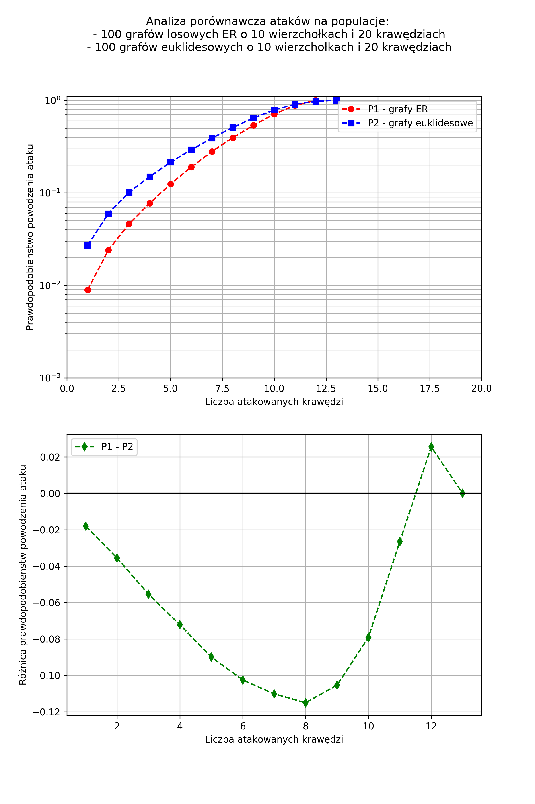
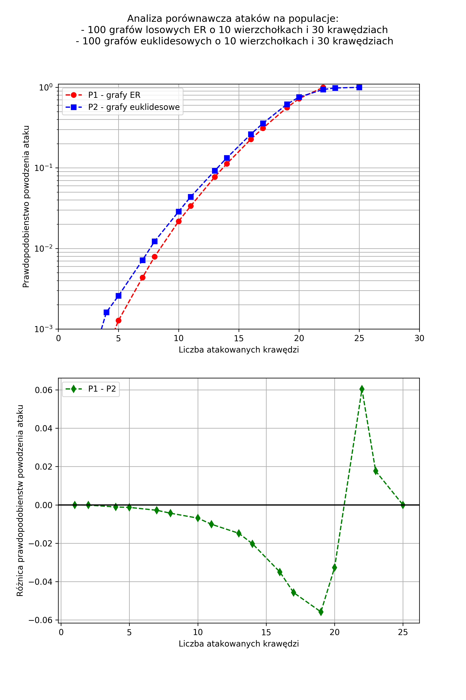
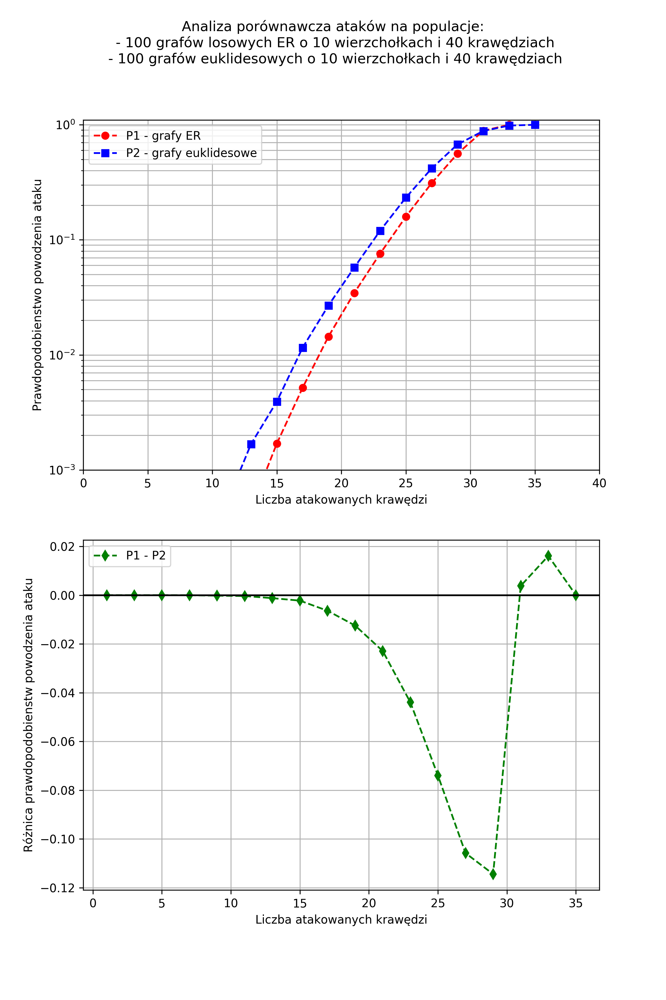

### Grafy o 100 wierzchołkach

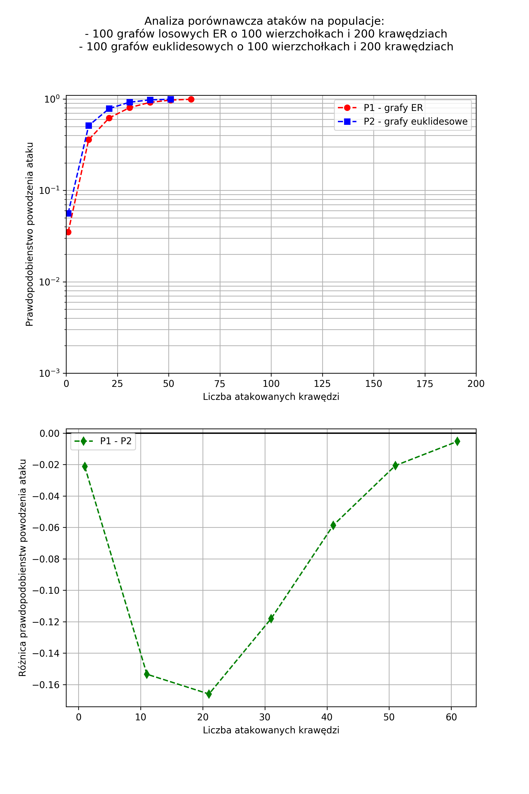
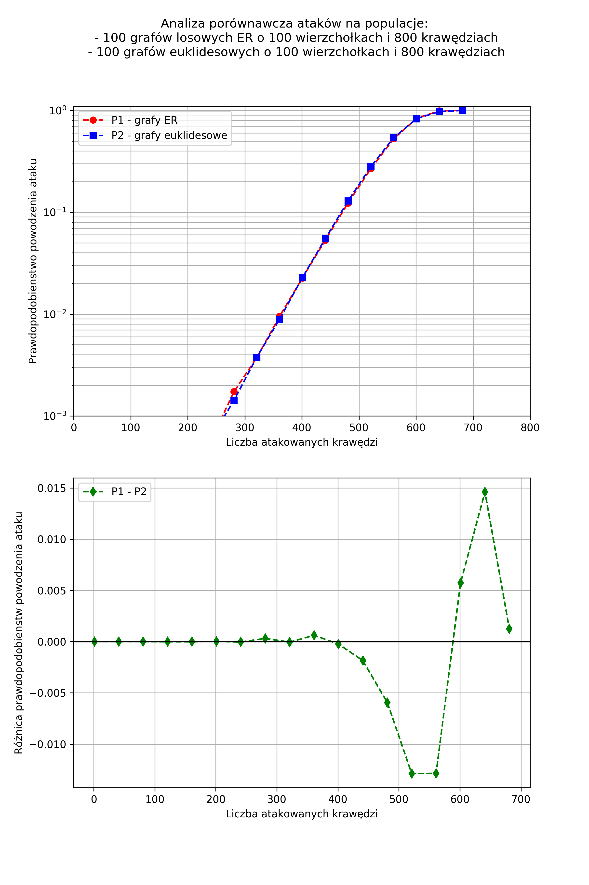
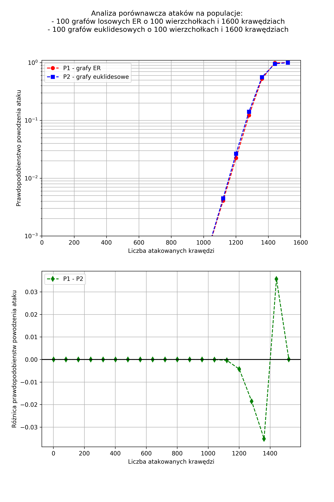
 
### Grafy o 1000 wierzchołkach

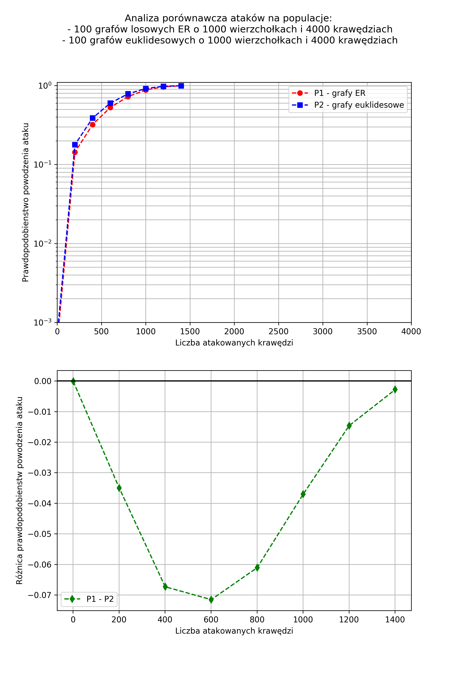
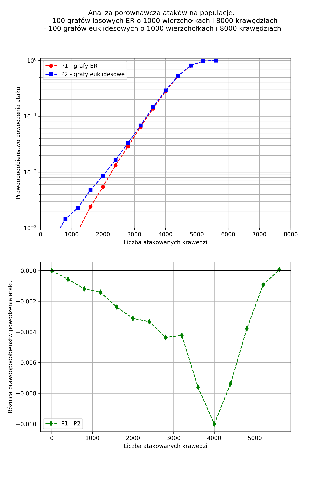
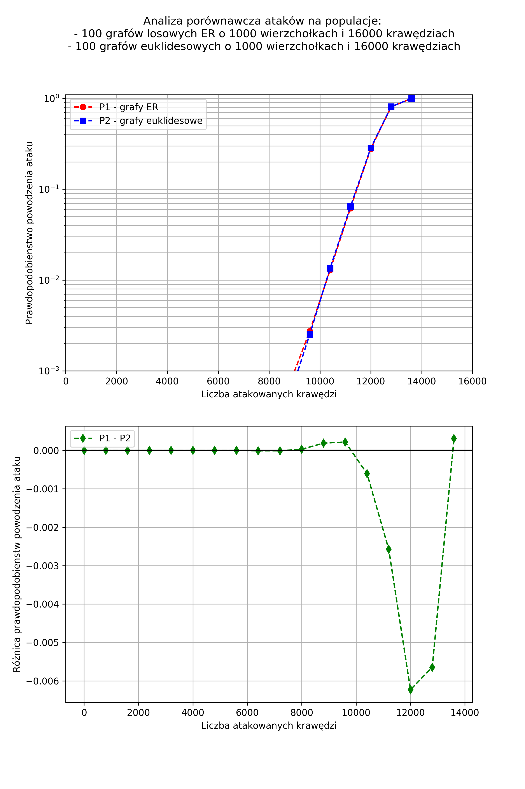

### Grafy o 4000 wierzchołkach
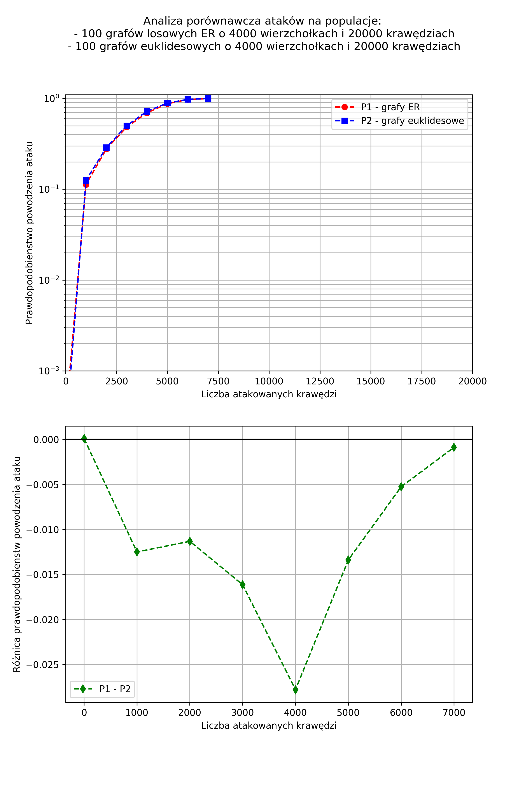
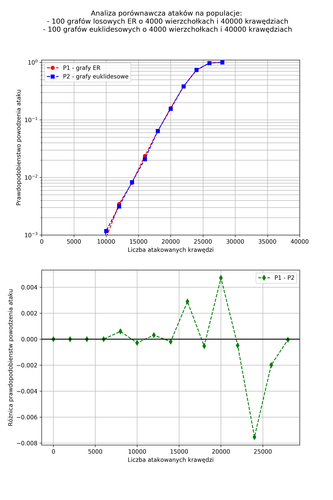
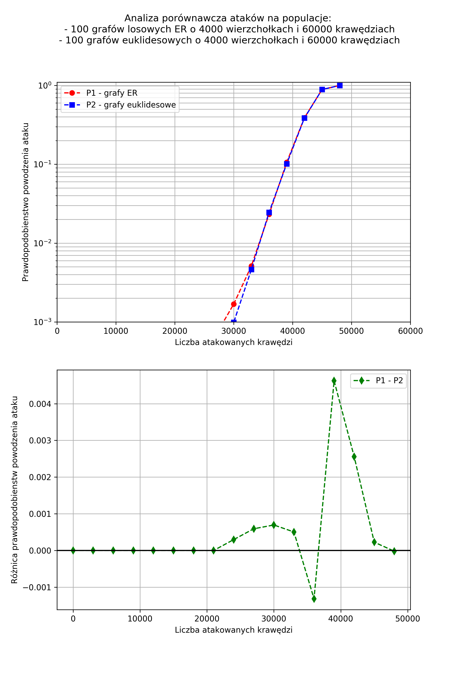

## Wnioski i obserwacje

Na podstawie przeprowadzonych badań zostały sformułowane wnioski przedstawione
poniżej.

Analiza wyników i porównanie wygenerowanych wykresów (przesunięcie wykresów w
lewo dla grafów euklidesowych) pozwala na stwierdzenie, że grafy euklidesowe
są bardziej podatne na rozspójnienie przy ataku na losowe krawędzie, od grafów
losowych Erdosa-Renyi o porównywalnej liczbie wierzchołków i krawędzi. Ulegają
one rozspójnieniu przy niższej krotności ataku.

Obserwacja ta jest zgodna z teorią ujętą w książce "Grafy i sieci" [\[4\]]() w
podrozdziale 17.6. Autor książki wskazuje, że grafy euklidesowowe składają się 
z wielu silnie spójnych składowych połączonych ze sobą niewielką ilością mostów.
Są one więc bardziej wrażliwe na ataki gdyż wystarczy zaatakować tylko kilka
kluczowych krawędzi w celu rozspójnienia.

Można również zaobserwować, że wraz ze wzrostem rozmiaru grafów różnice między
obiema klasami grafów zaczynają się zacierać. I tak dla grafów o 1000
wierzchołków i 16000 krawędzi oraz dla grafów o 4000 różnica między wykresami
zaciera się i dla obu typów wartości prawdopodobieństwa przy danej krotności
ataku są niemal identyczne.

Ponadto dla obu typów grafów można zaobserwować istnienie pewnej granicznej
krotności ataku poniżej, której praktycznie nie jest możliwe zakończenie ataku
sukcesem i rozspójnienie grafu. Wartość ta jst wyraźnie zależna od liczby
krawędzi grafu i wzrasta wraz z nią. Natomiast kształty wykresów po przekroczeniu
tej wartości wykazują lekkie różnice dla grafów losowych i euklidesowych.

Dla grafów euklidesowych maksymalna wartość prawdopodobieństwa $1.0$ osiągana jest
w sposób gwałtowny. Dla grafów euklidesowych zaś wykres zbiega do wartości $1.0$
o wiele łagodniej i wartość $1.0$ osiągana jest dla większej krotności ataku.
Objawia się to na wykresach z różnicą prawdopodobieństw powodzenia ataku gdzie 
można zaobserwować charakterystyczny pik po prawej stronie. 


## Bibliografia

- [\[1\] http://igraph.org/c/doc/](http://igraph.org/c/doc/)
- [\[2\] http://igraph.org/python/doc/igraph-module.html](http://igraph.org/python/doc/igraph-module.html)
- [\[3\] http://eduinf.waw.pl/inf/alg/001_search/0128a.php](http://eduinf.waw.pl/inf/alg/001_search/0128a.php)
- [\[4\] Grafy i sieci, Jacek Wojciechowski, Krzysztof Pieńkosz, PWN, Warszawa 2013]()

\pagebreak
## ZAŁĄCZNIK 1: Oryginalna treść sprawozdania nr 2

## Raport nr 2 do projektu w ramach kursu "Grafy i Sieci" (GIS) 

### Patryk Kocielnik, Jan Kumor, 07.05.2018r. (tekst ujednolicony)

---

## Opiekun projektu
dr inż. Sebastian Kozłowski

## Opis zadania

Dane są dwie sieci: euklidesowa i losowa (ER) o mniej więcej takiej samej
liczbie wierzchołków i krawędzi. Porównać prawdopodobieństwa powodzenia ataku na
losowe krawędzie tych sieci (udany atak to taki, który prowadzi do rozspójnienia
sieci).

## Planowane wykorzystanie narzędzi w projekcie

- Środowisko rozwiązania: stacja robocza pod kontrolą systemu GNU/Linux,
- Język implementacji rozwiązania: Python,
- Narzędzia do analizy i wizualizacji grafów: 
  - _igraph_ - bilbioteka języka C [\[1\]](http://igraph.org/c/doc/),
  - _python-igraph_ interfejs programistyczny biblioteki _igraph_ dla języka
  Python [\[2\]](http://igraph.org/python/doc/igraph-module.html),


## Składniki rozwiązania

1. Moduł generacji sieci: euklidesowych oraz losowych, o zadanej liczbie
wierzchołków:
   - Sposób wywołania: `graph = generate_graph(graph_type, vertices, edges)`,
   - Rezultat wywołania: obiekt typu `Graph` z pakietu _igraph_,
   - Podstawą komponentu będą moduły generowania sieci z pakietu _igraph_ -
funkcje `Erdos_Renyi` (dla grafów losowych) oraz `GRG` (dla grafów
euklidesowych) należące do klasy `Graph`.
2. Filtr usuwający z grafu wybraną krawędź:
   - Sposób wywołania: `new_graph = break(graph, edge)`.
   - Rezultat wywołania: `new_graph` jako graf pozbawiony wybranej krawędzi.
3. Analizator spójności sieci:
   - Sposób wywołania: `c = is_connected(graph)`
   - Rezultat wywołania: $c$ (`bool`) flaga przyjmująca wartość `True` jeśli
   graf jest spójny, przeciwnie`False`.
4. Moduł analizy ataku na zadany graf:
   - Sposób wywołania: `p = analyse_attack(graph)`,
   - Rezultat wywołania: $p$ (`float`) jako prawdopodobieństwo powodzenia ataku
   na losowo wybraną krawędź zadanego grafu wejściowego,
   - Moduł przeprowadza próby ataku na każdą z krawędzi grafu i na podstawie ich
   wyników oblicza prawdopodobieństwo powodzenia.

## Interfejs aplikacji

Interfejsem aplikacji będzie konsola tekstowa. Motywacją tego podejścia jest
łatwość łączenia aplikacji z interfejsem tekstowym w filtry, które później
wykorzystać można do analizy bardziej złożonych struktur.

## Przebieg eksperymentu

Zdefiniowane zostaną następujące zestawy parametrów:
- Typ grafu - euklidesowy lub losowy ER, 
- Liczba generowanych grafów $k$ - proponowana wartość w granicach od 100 do 1000,
- Liczba wierzchołków grafu $n$ - przyjmująca jedną z wartości: 10, 100, 1000, 4000,
- Liczba krawędzi grafu $m$ - przyjmująca logiczne wartości w zależności od $n$.

Następnie przeprowadzona zostanie analiza zgodnie z następującym algorytmem:
 
1. Z uprzednio zdefiniowanej listy zostanie przyjęty zestaw parametrów testu,
2. Wygenerowany zostanie zestaw $k$ grafów testowych o przyjętych wcześniej
parametrach,
3. Dla każdego z grafów:
   1. Dla każdej z krawędzi badanego grafu:
      1. Krawędź ta zostanie usunięta z grafu (zostanie przeprowadzony atak na
      tę krawędź),
      2. Sprawdzona zostanie spójność grafu po przeprowadzeniu ataku,
      3. Jeśli graf nie jest spójny atak zakończył się powodzeniem,
   2. Obliczone zostanie prawdopodobieństwo powodzenia ataku na losowo wybraną
   krawędź z badanego grafu, zgodnie ze wzorem: $p_i = \frac{n_{sukces}}{m}$
4. Zgodnie ze wzorem: $p_{sr} = \frac{\sum_{i=0}^{k} p_i}{k}$, zostanie
obliczone średnie prawdopodobieństwo powodzenia ataku dla zestawu $k$ grafów
testowych o przyjętych parametrach.
5. Jeśli pozostały nieprzetestowane zestawy parametrów, nastąpi powrót do
punktu 1.

## Generowanie grafów

Grafy losowe ER (model Erdős–Rényi) zostaną wygenerowane z użyciem funkcji 
`Erdos_Renyi` klasy `Graph` pakietu _igraph_. Metoda ta przyjmuje jako parametry:
- liczbę wierzchołków grafu $n$
- prawdopodobieństwo wystąpienia danej krawędzi $p$ lub zadaną liczbę krawędzi
$m$.

Zgodnie z dokumentacją pakietu _igraph_ algorytm wykorzystywany w metodzie
`Erdos_Renyi` ma złożoność obliczeniową równą $O(|V|+|E|)$
[\[1\]](http://igraph.org/c/doc/).

Grafy euklidesowe zostaną wygenerowane z wykorzystaniem funkcji `GRG` klasy 
`Graph` z pakietu _igraph_. Metoda ta przyjmuje jako parametry:
 - liczbę wierzchołków grafu $n$
 - promień $r$.
 
 Algorytm generacji grafu euklidesowego o $n$ wierzchołkach:

1. Rozmieść $n$ wierzchołków w kwadracie jednostkowym,
2. Połącz krawędziami te wierzchołki, które znajdują się od siebie w odległości mniejszej niż zadany promień $r$.
 
Zgodnie z dokumentacją pakietu _igraph_ implementacja algorytmu zastosowana 
w metodzie `GRG` ma złożoność obliczeniową nie większą niż $O(|V|^2+|E|)$
[\[1\]](http://igraph.org/c/doc/). 

W celu uzyskania grafu o zadanej przybliżonej liczbie krawędzi $m$ zostanie
wykorzystane następujące podejście iteracyjne:

1. Dla pewnego promienia $r$ wygeneruj graf euklidesowy o $n$
wierzchołkach z użyciem funkcji `GRG`,
2. Jeśli liczba krawędzi wygenerowanego grafu jest:
   - znacząco mniejsza od zadanej liczby krawędzi, zwiększ promień $r$,
   - znacząco większa od zadanej liczby krawędzi, zmniejsz promień $r$,
   - w przyliżeniu równa zadanej liczbie krawędzi, zwróć wygenerowany graf
   i zakończ algorytm,
3. Wróc do punktu 1.

Liczba krawędzi jest w przybliżeniu równa zadanej liczbie krawędzi gdy:
$\frac{|m_{zad}-m|}{m_{zad}} < \varepsilon$. Gdzie $\varepsilon$ jest parametrem
kontrolującym dokładność przybliżenia.

## Weryfikacja spójności grafu

Do weryfikacji spójności grafów zostanie wykorzystana metoda `is_connected` 
klasy `GraphBase` z pakietu _igraph_. Opiera się ona na algorytmie
przeszukiwania grafu wgłąb (ang. _depth-first search_, DFS).

Pseudokod algorytmu DFS [\[3\]](http://eduinf.waw.pl/inf/alg/001_search/0128a.php),
przedstawiony został poniżej :

1. Utwóż tablicę `visited` o `n` elementach,
2. Tablicę `visited` wypełnij wartościami `false`,
3. Utwórz pusty stos `S`,
4. Inicjuj licznik odwiedzonych wierzchołków,
5. Rozpocznij przejście DFS od wierzchołka 0,
6. Wierzchołek oznacz jako odwiedzony,
7. Przechodź przez graf dopóki stos `S` nie jest pusty, wykonując następujące
kroki:
   - Pobierz wierzchołek ze stosu,
   - Pobrany wierzchołek usuń ze stosu,
   - Zwiększ licznik odwiedzonych wierzchołków,
   - Przejrzyj kolejnych sąsiadów,
     - Szukaj do sąsiadów jeszcze nie odwiedzonych,
     - Odznacz sąsiada jeśli jeszcze nie odwiedzony,
     - Umieść sąsiada na stosie.
Jeśli wszystkie wierzchołki zostały odwiedzone, graf jest spójny. W przeciwnym
wypadku, graf jest niespójny.

Złożoność czasowa algorytmu wynosi $O(|E| + |V|)$.

## Model danych

Projektowane narzędzie wykorszystywać będzie implementacje grafów nieskierowanych z biblioteki _igraph_.

Graf we wspomnianej implementacji jest reprezentowany jako wielozbiór krawędzi
oraz metadane. Najważniejszymi polami zawartymi w metadanych są:

* liczba wierzchołków grafu,
* określenie czy graf jest skierowany czy nie.

Każda z krawędzi grafu nieskierowanego jest modelowana jako nieuporządkowana para (dwuelementowy
zbiór) etykiet oznaczających wierzchołki grafu. Krawędzie są etykietowane, a
etykiety przyjmują wartości od $0$ do $|E| - 1$. Etykiety wierzchołków przyjmują
wartości od $0$ do $|V| - 1$.

Przykładową, uproszczoną (pominięto etykiety krawędzi) strukturę grafu
nieskierowanego przedstawiono poniżej:
```
 ( wierzchołki: 6,
   skierowany: nie,
   krawędzie:
    {
     {0,2},
     {2},
     {2,3},
     {3},
     {3,4},
     {3,4},
     {4,1}
    }
  )
```

Należy nadmienić, iż implementacja ta dopuszcza istnienie w grafie pętli. Jednak
w projektowanym narzędziu grafy takie nie będą rozpatrywane.

## Testy poprawności rozwiązania

Poprawność zaproponowanego rozwiązania zostanie sprawdzona na podstawie
przeprowadzenia testów dla prostych grafów, o niewielkiej liczbie wierzchołków
i krawędzi. Dla niewielkich grafów łątwo można dokonać dokładnej analizy 
i obliczyć dla nich prawdopodobieństwa powodzenia ataku na losowo wybraną
krawędź. Proponowane grafy testowe to:

- 2 wierzchołki, 1 krawędź - oczekiwane prawdopodobieństwo powodzenia ataku 1.0,
- 3 wierzchołki, 2 krawędzie - oczekiwane prawdopodobieństwo powodzenia ataku 1.0,
- 3 wierzchołki, 3 krawędzie - oczekiwane prawdopodobieństwo powodzenia ataku 0.0,
- 4 wierzchołki, 3 krawędzie - oczekiwane prawdopodobieństwo powodzenia ataku 0.8,
- 4 wierzchołki, 4 krawędzie - oczekiwane prawdopodobieństwo powodzenia ataku 0.2,
- 4 wierzchołki, 5 krawędzi - oczekiwane prawdopodobieństwo powodzenia ataku 0.0. 

Pozytywna weryfikacja rozwiązania na tych grafach pozwoli mieć nadzieję na jego
poprawne działanie dla grafów o większej liczbie wierzchołków, sięgającej 4000.
Wyniki te zostaną poddane również krytycznej analizie, czy są one zgodne z
przewidywaniami. Częścią weryfikacji będzie również, wykonanie pełnego zestawu 
eksperymentów co najmniej dwukrotnie w celu potwierdzenia powtarzalności uzyskanych
wyników. 

## Dodatkowe założenia programu

Jako dodatkowe założenie planowane jest wykorzystanie mechanizmów zrównoleglania
obliczeń w celu zmniejszenia czasu wykonywania eksperymentów. Specyfika problemu
pozwala na dogodne wydzielenie niezależnych fragmentów programu - badanie
każdego z $k$ testowych grafów może być przeprowadzane niezależnie. Jedyną
częścią synchroniczną jest agregacja wyników w postaci średniego
prawdopodobieństwa powodzenia ataku na losową krawędź grafu o zadanych parametrach.

## Bibliografia

- [\[1\] http://igraph.org/c/doc/](http://igraph.org/c/doc/)
- [\[2\] http://igraph.org/python/doc/igraph-module.html](http://igraph.org/python/doc/igraph-module.html)
- [\[3\] http://eduinf.waw.pl/inf/alg/001_search/0128a.php](http://eduinf.waw.pl/inf/alg/001_search/0128a.php)
    
---
 
## Errata do sprawozdania nr 1

Oryginalny tekst sprawozdania nr 1 zawiera ZAŁĄCZNIK 1.

### I.

W sekcji *Planowane wykorzystanie narzędzi w projekcie* zmianie uległo brzmienie
podpunkt trzeciego.

Było:

>- Narzędzie do wizualizacji wyników i referencyjnej weryfikacji rozwiązań: Graph-Tool - biblioteka dla języka Python

Jest:

>- Narzędzia do analizy i wizualizacji grafów: 
>  - _igraph_ - bilbioteka języka C [\[1\]](http://igraph.org/c/doc/),
>  - _python-igraph_ interfejs programistyczny biblioteki _igraph_ dla języka Python [\[2\]](http://igraph.org/python/doc/igraph-module.html),

### II.

W sekcji *Składniki rozwiązania* w punkcie 1. zaszły następujące zmiany:

Było:

>1. Moduł generacji sieci: euklidesowych oraz losowych, o zadanej liczbie wierzchołków:
>   - Sposób wywołania: `graph = generate_graph(graph_type, vertex_probability)`,
>   - Rezultat wywołania: `graph` jako dwuwymiarowa macierz sąsiedztwa (`int` * `int`) opisująca wygenerowany graf,
>   - Podstawą komponentu będzie moduł generacji sieci z pakietu Graph-Tools [\[1\]](https://graph-tool.skewed.de/static/doc/generation.html#graph_tool.generation.random_graph).

Jest:

>1. Moduł generacji sieci: euklidesowych oraz losowych, o zadanej liczbie
>wierzchołków:
>   - Sposób wywołania: `graph = generate_graph(graph_type, vertices, edges)`,
>   - Rezultat wywołania: obiekt typu `Graph` z pakietu _igraph_,
>   - Podstawą komponentu będą moduły generowania sieci z pakietu _igraph_ -
>funkcje `Erdos_Renyi` (dla grafów losowych) oraz `GRG` (dla grafów
>euklidesowych) należące do klasy `Graph`.

W punkcie 3. zachodzą następujące zmiany:

Było:

>3. Analizator spójności sieci:
>   - Sposób wywołania: `consistency_degree(graph)`,
>   - Rezultat wywołania: $n$ (`int`) jako liczba oznaczająca stan spójności grafu wejściowego: $0$ - niespójny, $1$ - spójny.

Jest:

>3. Analizator spójności sieci:
>   - Sposób wywołania: `c = is_connected(graph)`
>   - Rezultat wywołania: $c$ (`bool`) flaga przyjmująca wartość `True` jeśli
>   graf jest spójny, przeciwnie`False`.

Dodano punkt 4. opisujący moduł analizujący atak na zadany graf.

Jest:

>4. Moduł analizy ataku na zadany graf:
>   - Sposób wywołania: `p = analyse_attack(graph)`,
>   - Rezultat wywołania: $p$ (`float`) jako prawdopodobieństwo powodzenia ataku
>   na losowo wybraną krawędź zadanego grafu wejściowego,
>   - Moduł przeprowadza próby ataku na każdą z krawędzi grafu i na podstawie
>   ich wyników oblicza prawdopodobieństwo powodzenia.

### III.

Treść sekcji *Przebieg eksperymentu* została skonsolidowana z sekcją
*Schemat testów*. Istotną zmianą jest ograniczenie maksymalnej liczby
wierzchołków badanych grafów do 4000. Zmiana ta wynika z przeprowadzenia
wstępnych badań, i pozwala na zachowanie bardziej praktycznego czasu obliczeń.

Było:

>Liczbę iteracji $k$ ustal na wartość z przedziału od 1 do 25.
>Liczbę wierzchołków $v$ ustal na należącą do zbioru $V_num$: 10, 100, 1000, 10000, 100000,
>Liczbę krawędzi ustal na należącą do zbioru $E_num$: 10, 100, 1000, 10000, 100000.
>
>1. Powtórz dla k przypadków:
>  1. Wygeneruj graf o zadanym typie, liczbie wierzchołków `v` i liczbie krawędzi `e`,
>  2. Usuń z grafu losowo wybraną krawędź,
>  3. Sprawdź, czy nastąpiło rozspójnienie grafu.
>2. Oblicz iloczyn: $rozspójnień / ataków$

Jest:

>Zdefiniowane zostaną następujące zestawy parametrów:
>- Typ grafu - euklidesowy lub losowy ER, 
>- Liczba generowanych grafów $k$ - proponowana wartość w granicach od 100 do 1000,
>- Liczba wierzchołków grafu $n$ - przyjmująca jedną z wartości: 10, 100, 1000, 4000,
>- Liczba krawędzi grafu $m$ - przyjmująca logiczne wartości w zależności od $n$.
>
>Następnie przeprowadzona zostanie analiza zgodnie z następującym algorytmem:
> 
>1. Z uprzednio zdefiniowanej listy zostanie przyjęty zestaw parametrów testu,
>2. Wygenerowany zostanie zestaw $k$ grafów testowych o przyjętych wcześniej
>parametrach,
>3. Dla każdego z grafów:
>   1. Dla każdej z krawędzi badanego grafu:
>      1. Krawędź ta zostanie usunięta z grafu (zostanie przeprowadzony atak na
>      tę krawędź),
>      2. Sprawdzona zostanie spójność grafu po przeprowadzeniu ataku,
>      3. Jeśli graf nie jest spójny atak zakończył się powodzeniem,
>   2. Obliczone zostanie prawdopodobieństwo powodzenia ataku na losowo wybraną
>   krawędź z badanego grafu, zgodnie ze wzorem: $p_i = \frac{n_{sukces}}{m}$
>4. Zgodnie ze wzorem: $p_{sr} = \frac{\sum_{i=0}^{k} p_i}{k}$, zostanie
>obliczone średnie prawdopodobieństwo powodzenia ataku dla zestawu $k$ grafów
>testowych o przyjętych parametrach.
>5. Jeśli pozostały nieprzetestowane zestawy parametrów, nastąpi powrót do
>punktu 1. 

### IV.
Sekcja *Generowanie grafów losowych* została przemianowana na
*Generowanie grafów* oraz zmieniono jej treść.

Było:

>## Generowanie grafów losowych
>Generowanie grafu losowego będzie podzielone na dwa etapy.
>
>Pierwszym etapem będzie przyjęcie zadanej liczby wierzchołków oraz zadanej gęstości grafu i obliczenie z nich docelowej liczby krawędzi $q_target$dla grafu wyjściowego. Drugi etap polegał będzie na wygenerowaniu grafu o n wierzchołkach połączonych losowo $q_target$ krawędziami.
>
>Algorytm ten przyjmuje dwa argumenty: liczbę wierzchołków $n$ oraz współczynnik prawdopodobieństwa wystąpienia krawędzi $n$.
>
>Grafy euklidesowe generowane będą poprzez weryfikację, czy dany losowo wygenerowany graf posiada własności grafu euklidesowego. Wygenerowane grafy nie spełniające tego warunku będą odrzucane.
>
>Złożoność obliczeniowa algorytmu:
>
>$(n * (n - 1)) / 2$
>
>Oczekiwana liczba krawędzi:
>
>$(n * (n - 1) * p) / 2$
>
>Spodziewany średni stopień wierzchołka:
>
>$(n - 1) * p$

Jest:

>## Generowanie grafów
>
>Grafy losowe ER (model Erdős–Rényi) zostaną wygenerowane z użyciem funkcji 
>`Erdos_Renyi` klasy `Graph` pakietu _igraph_. Metoda ta przyjmuje jako parametry:
>- liczbę wierzchołków grafu $n$
>- prawdopodobieństwo wystąpienia danej krawędzi $p$ lub zadaną liczbę krawędzi
>$m$.
>
>Zgodnie z dokumentacją pakietu _igraph_ algorytm wykorzystywany w metodzie
>`Erdos_Renyi` ma złożoność obliczeniową równą $O(|V|+|E|)$
>[\[1\]](http://igraph.org/c/doc/).
>
>Grafy euklidesowe zostaną wygenerowane z wykorzystaniem funkcji `GRG` klasy 
>`Graph` z pakietu _igraph_. Metoda ta przyjmuje jako parametry:
> - liczbę wierzchołków grafu $n$
> - promień $r$.
> 
> Algorytm generacji grafu euklidesowego o $n$ wierzchołkach:
>
>1. Rozmieść $n$ wierzchołków w kwadracie jednostkowym,
>2. Połącz krawędziami te wierzchołki, które znajdują się od siebie w odległości mniejszej niż zadany promień $r$.
> 
>Zgodnie z dokumentacją pakietu _igraph_ implementacja algorytmu zastosowana 
>w metodzie `GRG` ma złożoność obliczeniową nie większą niż $O(|V|^2+|E|)$
>[\[1\]](http://igraph.org/c/doc/). 
>
>W celu uzyskania grafu o zadanej przybliżonej liczbie krawędzi $m$ zostanie
>wykorzystane następujące podejście iteracyjne:
>
>1. Dla pewnego promienia $r$ wygeneruj graf euklidesowy o $n$
>wierzchołkach z użyciem funkcji `GRG`,
>2. Jeśli liczba krawędzi wygenerowanego grafu jest:
>   - znacząco mniejsza od zadanej liczby krawędzi, zwiększ promień $r$,
>   - znacząco większa od zadanej liczby krawędzi, zmniejsz promień $r$,
>   - w przyliżeniu równa zadanej liczbie krawędzi, zwróć wygenerowany graf
>   i zakończ algorytm,
>3. Wróc do punktu 1.
>
>Liczba krawędzi jest w przybliżeniu równa zadanej liczbie krawędzi gdy:
>$\frac{|m_{zad}-m|}{m_{zad}} < \varepsilon$. Gdzie $\varepsilon$ jest parametrem
>kontrolującym dokładność przybliżenia.

### V.

W sekcji *Weryfikacja spójności grafu* dodano wstęp na temat wykorzystania
pakietu _igraph_.

Było:

>Pseudokod algorytmu DFS [\[2\]](http://eduinf.waw.pl/inf/alg/001_search/0128a.php), który zostanie wykorzystany do badania spójności grafów, przedstawiony został poniżej :

Jest:

>Do weryfikacji spójności grafów zostanie wykorzystana metoda `is_connected` 
>klasy `GraphBase` z pakietu _igraph_. Opiera się ona na algorytmie
>przeszukiwania grafu wgłąb (ang. _depth-first search_, DFS).
>
>Pseudokod algorytmu DFS [\[3\]](http://eduinf.waw.pl/inf/alg/001_search/0128a.php),
>przedstawiony został poniżej :

### VI.

Sekcja *Schemat testów* została usunięta.

Było:

>## Schemat testów
>
>Testy zostaną przeprowadzone w następujący sposób:
>
>1. Wygenerowany zostanie zestaw grafów testowych o podanych wcześniej
>parametrach,
>2. Z każdego z grafów zostanie usunięta losowo wybrana krawędź,
>3. Spójność grafu zostanie sprawdzona i zapisana,
>4. Obliczone zostanie prawdopodobieństwo rozspójnienia grafu $P$ jako iloraz:
>$rozspójnień / ataków$

\pagebreak
## ZAŁĄCZNIK 2: Oryginalna treść sprawozdania nr 1

## Raport wstępny do projektu w ramach kursu "Grafy i Sieci" (GIS)

### Patryk Kocielnik, Jan Kumor, 5.04.2018r.

---

## Opiekun projektu
dr inż. Sebastian Kozłowski

## Opis zadania

Dane są dwie sieci: euklidesowa i losowa (ER) o mniej więcej takiej samej liczbie wierzchołków i krawędzi. Porównać prawdopodobieństwa powodzenia ataku na losowe krawędzie tych sieci (udany atak to taki, który prowadzi do rozspójnienia sieci).

## Planowane wykorzystanie narzędzi w projekcie

- Środowisko rozwiązania: stacja robocza pod kontrolą systemu GNU/Linux,
- Język implementacji rozwiązania: Python,
- Narzędzie do wizualizacji wyników i referencyjnej weryfikacji rozwiązań: Graph-Tool - biblioteka dla języka Python,

## Składniki rozwiązania

1. Moduł generacji sieci: euklidesowych oraz losowych, o zadanej liczbie wierzchołków.
   - Sposób wywołania: `graph = generate_graph(graph_type, vertex_probability)`,
   - Rezultat wywołania: `graph` jako dwuwymiarowa macierz sąsiedztwa (`int` * `int`) opisująca wygenerowany graf,
   - Podstawą komponentu będzie moduł generacji sieci z pakietu Graph-Tools [\[1\]](https://graph-tool.skewed.de/static/doc/generation.html#graph_tool.generation.random_graph).
2. Filtr usuwający z grafu losowo wybraną krawędź
   - sposób wywołania: `new_graph = break(graph)`.
   - rezultat wywołania: `new_graph` jako graf pozbawiony losowo wybranej krawędzi.
3. Analizator spójności sieci
   - Sposób wywołania: consistency\_degree(graph),
   - Rezultat wywołania: $n$ (`int`) jako liczba oznaczająca stan spójności grafu wejściowego: $0$ - niespójny, $1$ - spójny,

## Interfejs aplikacji

Interfejsem aplikacji będzie konsola tekstowa. Motywacją tego podejścia jest
łatwość łączenia aplikacji z interfejsem tekstowym w filtry, które później wyko-
rzystać można do analizy bardziej złożonych struktur.

## Przebieg eksperymentu

Liczbę iteracji $k$ ustal na wartość z przedziału od 1 do 25.
Liczbę wierzchołków $v$ ustal na należącą do zbioru $V_num$: 10, 100, 1000, 10000, 100000,
Liczbę krawędzi ustal na należącą do zbioru $E_num$: 10, 100, 1000, 10000, 100000.

1. Powtórz dla k przypadków:
  1. Wygeneruj graf o zadanym typie, liczbie wierzchołków `v` i liczbie krawędzi `e`,
  2. Usuń z grafu losowo wybraną krawędź,
  3. Sprawdź, czy nastąpiło rozspójnienie grafu.
2. Oblicz iloczyn: $rozspójnień / ataków$

## Generowanie grafów losowych

Generowanie grafu losowego będzie podzielone na dwa etapy.

Pierwszym etapem będzie przyjęcie zadanej liczby wierzchołków oraz zadanej gęstości grafu i obliczenie z nich docelowej liczby krawędzi $q_target$dla grafu wyjściowego. Drugi etap polegał będzie na wygenerowaniu grafu o n wierzchołkach połączonych losowo $q_target$ krawędziami.

Algorytm ten przyjmuje dwa argumenty: liczbę wierzchołków $n$ oraz współczynnik prawdopodobieństwa wystąpienia krawędzi $n$.

Grafy euklidesowe generowane będą poprzez weryfikację, czy dany losowo wygenerowany graf posiada własności grafu euklidesowego. Wygenerowane grafy nie spełniające tego warunku będą odrzucane.

Złożoność obliczeniowa algorytmu:

$(n * (n - 1)) / 2$

Oczekiwana liczba krawędzi:

$(n * (n - 1) * p) / 2$

Spodziewany średni stopień wierzchołka:

$(n - 1) * p$

## Weryfikacja spójności grafu

Pseudokod algorytmu DFS [\[2\]](http://eduinf.waw.pl/inf/alg/001_search/0128a.php), który zostanie wykorzystany do badania spójności grafów, przedstawiony został poniżej :

1. Utwóż tablicę `visited` o `n` elementach,
2. Tablicę `visited` wypełnij wartościami `false`,
3. Utwórz pusty stos `S`,
4. Inicjuj licznik odwiedzonych wierzchołków,
5. Rozpocznij przejście DFS od wierzchołka 0,
6. Wierzchołek oznacz jako odwiedzony,
7. Przechodź przez graf dopóki stos `S` nie jest pusty, wykonując następujące kroki:
  - Pobierz wierzchołek ze stosu,
  - Pobrany wierzchołek usuń ze stosu,
  - Zwiększ licznik odwiedzonych wierzchołków,
  - Przejrzyj kolejnych sąsiadów,
    - Szukaj do sąsiadów jeszcze nie odwiedzonych,
    - Odznacz sąsiada jeśli jeszcze nie odwiedzony,
    - Umieść sąsiada na stosie.
Jeśli wszystkie wierzchołki zostały odwiedzone, graf jest spójny. W przeciwnym wypadku, graf jest niespójny.

Złożoność czasowa algorytmu wynosi $O(E + V)$

## Schemat testów

Testy zostaną przeprowadzone w następujący sposób:

1. Wygenerowany zostanie zestaw grafów testowych o podanych wcześniej parametrach,
2. Z każdego z grafów zostanie usunięta losowo wybrana krawędź,
3. Spójność grafu zostanie sprawdzona i zapisana,
4. Obliczone zostanie prawdopodobieństwo rozspójnienia grafu $P$ jako iloraz: $rozspójnień / ataków$

\pagebreak
## ZAŁĄCZNIK 3: Kod źródłowy modułu attack.py

```
import random
import math
from collections import namedtuple

import igraph
import numpy as np
import matplotlib.pyplot as plt


class GISError(ValueError):
    pass


def generate_euclidean_graph(n, m):
    """Generates euclidean graph of given number of vertices and number of
    edges approximate to given one.

    Uses formula for expected value of number of edges for euclidean graph:

    Em = pi*ksi^2 * n(n-1)/2

    Where:
        Em - expected value for number of edges
        ksi - euclidean graph radius
        n - number of vertices

    :param n: Expected value for number of vertices.
    :param m: Expected value for number of edges.

    :return: Generated euclidean graph.
    """
    radius = (2 * m / (math.pi * n * (n - 1))) ** 0.5
    g = igraph.Graph.GRG(n, radius, torus=True)
    return g.clusters().giant()


def generate_random_graph(n, m):
    """Generates random (ER) graph of given number of vertices and edges.

    :param n: Number of vertices.
    :param m: Number of edges.

    :return: Generated random (ER) graph.
    """
    ksi = 2*m / (n*(n-1))
    if ksi < 1/n:
        raise GISError(f"Can't generate connected random ER graph ksi={ksi} "
                         f"is lower than 1/n={1/n}.")
    g = igraph.Graph.Erdos_Renyi(n, m=m, directed=False)
    return g.clusters().giant()


def graph_factory(graph_type, n, m, epsilon):
    """ Creates graph based on given attributes.

    :param graph_type: Type of graphs in population: "random" or "euclidean".
    :param n: Expected value for generated graph number of vertices.
    :param m: Expected value for number of edges of graph.
    :param epsilon: Tells how close to expected values the number of vertices
        and edges should be.
    :return: Generated graph.
    """
    max_tries = 100
    factory_methods = {
        "random": generate_random_graph,
        "euclidean": generate_euclidean_graph
    }
    if epsilon is None:
        return factory_methods[graph_type](n, m)
    for _ in range(max_tries):
        g = factory_methods[graph_type](n, m)
        deviations = (n - g.vcount()) / n, (m - g.ecount()) / m
        if max(map(abs, deviations)) < epsilon:
            break
    else:
        raise GISError(
            f"Failed after {max_tries} tries when generating "
            f"graph:\n"
            f"- type: {graph_type}\n"
            f"- vertices: {n}\n"
            f"- edges: {m}\n"
            f"Interrupting processing, please reconsider if it is possible to "
            f"create such connected graph within given epsilon boundaries " 
            f"({epsilon}).")
    return g


def generate_graph_population(population_size, graph_type, n, m,
                              epsilon=0.1):
    """ Creates population of graphs with given attributes.

    :param population_size: Size of population to be generated.
    :param graph_type: Type of graphs in population: "random" or "euclidean".
    :param n: Size of generated graphs in population.
    :param m: Expected value for number of edges of graphs in
        population.
    :param epsilon: Tells how close to expected value the number of vertices
        and edges should be.
    :return: Generated population of graphs as a list.
    """
    try:
        return [graph_factory(graph_type, n, m, epsilon)
                for _ in range(population_size)]
    except GISError as e:
        #raise GISError(f"Problem when generating graph population: {e}")
        print(f"Problem when generating graph population: {e}")
        return []


def get_random_edge(g):
    """Gets random edge of a given graph.

    :param g: Given graph.

    :return: Random choosen edge of a graph.
    """
    return random.choice(g.es())


def attack_random(g):
    """Perform attack on given graph by removing one of the edges.

    :param g: Graph which will be attacked.
    :return: Graph after performing an attack.
    """
    if g.ecount() == 0 or g.vcount() == 0:
        raise ValueError("Can't perform attack on graph with 0 edges or "
                         "vertices.")
    edge = get_random_edge(g)
    return g - edge


def perform_attack_old(g, multiplicity):
    """Performs attack of given multiplicity on a graph.

    :param g: Attacked graph.
    :param multiplicity: Quantity of edges that are removed during attack.
    :return: Graphs after attack.
    """
    for _ in range(multiplicity):
        g = attack_random(g)
    return g


def perform_attack(g, multiplicity):
    """Performs attack of given multiplicity on a graph.

    New impl (roughly 100 times faster) makes usage of igraph native methods.

    :param g: Attacked graph.
    :param multiplicity: Quantity of edges that are removed during attack.
    :return: Graphs after attack.
    """
    result = g.copy()
    result.delete_edges(random.sample(list(g.es), k=multiplicity))
    return result


AttackResult = namedtuple("AttackResult", "tries successes failures probability")


def analyse_graph_attack(g, tries, multiplicity, failure_threshold=None):
    """Performs analysis of random attacks on given graph.

    :param g: Analysed graph.
    :param tries: Number of random attack tries to be performed.
    :param multiplicity: Quantity of edges that are removed during attack.
    :param failure_threshold: Tells after how many failed attack attempts
        analysis should be forfeited. If None all tries are performed despite
        failures. Defaults to None.
    :return: AnalysisResult type tuple.
    """
    failures = 0
    successes = 0
    for i in range(tries):
        eff_multiplicity = min(multiplicity, g.ecount())
        attacked_g = perform_attack(g, eff_multiplicity)
        if attacked_g.is_connected():
            failures += 1
        else:
            successes += 1
        if failure_threshold is not None and failures == failure_threshold:
            break
    tries_performed = i+1
    return AttackResult(tries_performed, successes, failures,
                        successes/tries_performed)


PopulationParameters = namedtuple("PopulationParameters",
                                  "size graph_type n m")

PopulationParametersTest = namedtuple("PopulationParametersTest",
                                      "size graph_type n m epsilon")


AttackParameters = namedtuple("AttackParameters",
                              "tries multiplicity failure_threshold")


PopulationAttackResult = namedtuple("PopulationAttackResult",
                                    "attack_parameters mean results")


def analyse_population_attack(population, attack_parameters):
    """Performs series of attack analysis on each graph from given
    population.

    :param population:
    :param attack_parameters:
    :return:
    """
    results = [analyse_graph_attack(g, *attack_parameters)
               for g in population]
    mean_result = AttackResult(*tuple(np.mean(results, axis=0)))
    return PopulationAttackResult(attack_parameters, mean_result, results)


def plot_results(pparams, results):
    """Plots population analysis results into file.
    """
    fig = plt.figure()
    ax = fig.add_subplot(111)
    x = [r.attack_parameters.multiplicity for r in results]
    y = [r.mean.probability for r in results]
    plt.plot(x, y, '--ro')
    axes = plt.gca()
    axes.set_xlim([0, pparams.m])
    axes.set_ylim([0, 1.1])
    plt.grid(True)
    gtype = {
        "random": "losowych ER",
        "euclidean": "euklidesowych"
    }
    plt.title(f"Analiza ataków na populację {pparams.size} grafów "
              f"{gtype[pparams.graph_type]} o:\n"
              f" {pparams.n} wierzchołkach i {pparams.m} krawędziach")
    plt.xlabel("Liczba atakowanych krawędzi")
    plt.ylabel("Prawdopodobienstwo powodzenia ataku")
    # for x, y in zip(x, y):
    #     ax.annotate(f"({x}, {y:.2f})", xy=(x, y), textcoords='data', fontsize=3)
    file_name = f"N{pparams.n}_M{pparams.m}_{pparams.graph_type}"
    plt.savefig(f"plots/{file_name}.png", dpi=300)


POPULATION_SIZE = 100

ATTACK_TRIES = 10000

FAILURE_THRESHOLD = ATTACK_TRIES/10

test_data_sets = [
        PopulationParameters(POPULATION_SIZE, "random", 2, 1),
        PopulationParameters(POPULATION_SIZE, "random", 3, 2),
        PopulationParameters(POPULATION_SIZE, "random", 3, 3),
        PopulationParameters(POPULATION_SIZE, "random", 4, 3),
        PopulationParameters(POPULATION_SIZE, "random", 4, 4),
        PopulationParameters(POPULATION_SIZE, "random", 4, 5),
    ]

data_sets_10 = [
    PopulationParameters(POPULATION_SIZE, "random", 10, 20),
    PopulationParameters(POPULATION_SIZE, "euclidean", 10, 20),
    PopulationParameters(POPULATION_SIZE, "random", 10, 30),
    PopulationParameters(POPULATION_SIZE, "euclidean", 10, 30),
    PopulationParameters(POPULATION_SIZE, "random", 10, 40),
    PopulationParameters(POPULATION_SIZE, "euclidean", 10, 40),
]

data_sets_100 = [
    PopulationParameters(POPULATION_SIZE, "random", 100, 200),
    PopulationParameters(POPULATION_SIZE, "euclidean", 100, 200),
    PopulationParameters(POPULATION_SIZE, "random", 100, 800),
    PopulationParameters(POPULATION_SIZE, "euclidean", 100, 800),
    PopulationParameters(POPULATION_SIZE, "random", 100, 1600),
    PopulationParameters(POPULATION_SIZE, "euclidean", 100, 1600),
]

data_sets_1000 = [
    PopulationParameters(POPULATION_SIZE, "random", 1000, 4000),
    PopulationParameters(POPULATION_SIZE, "euclidean", 1000, 4000),
    PopulationParameters(POPULATION_SIZE, "random", 1000, 8000),
    PopulationParameters(POPULATION_SIZE, "euclidean", 1000, 8000),
    PopulationParameters(POPULATION_SIZE, "random", 1000, 16000),
    PopulationParameters(POPULATION_SIZE, "euclidean", 1000, 16000),
]

data_sets_4000 = [
    PopulationParameters(POPULATION_SIZE, "random", 4000, 20000),
    PopulationParameters(POPULATION_SIZE, "euclidean", 4000, 20000)
]

all_data_sets = data_sets_10 + data_sets_100 + data_sets_1000


def process(data_sets=all_data_sets, is_test=False, truncate=False):
    """ Performs experiment by performing series of attack analysis over
    graph populations defined in data sets.

    :param data_sets: List of experiment run definitions.
    :param is_test: Defaults False.
    :param truncate: If analysis should stop when probability reaches 0.
    :return:
    """
    for pparam in data_sets:
        print(f"### Analysing graph population defined by: {pparam}")
        if is_test:
            pparam = PopulationParametersTest(*pparam, None)
        population = generate_graph_population(*pparam)
        results = []
        for i in range(20):
            attack_parameters = AttackParameters(ATTACK_TRIES,
                                                 int(1+i*(pparam.m/20)),
                                                 FAILURE_THRESHOLD)
            result = analyse_population_attack(population, attack_parameters)
            results.append(result)
            print(f"## Analysis results:\n"
                  f"# Params: {result.attack_parameters}\n"
                  f"# Mean: {result.mean}")
            if truncate and math.isclose(result.mean.probability, 1.0,
                                         abs_tol=0.01):
                break
        plot_results(pparam, results)
    return None


def test():
    process(test_data_sets, True)


if __name__ == '__main__':
    process()

```