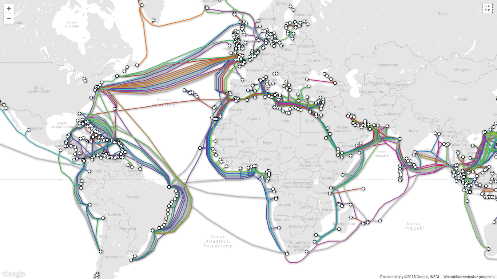

1. World-scale
2. Europe

According to the map dated to year 2016, Poland has two submarine Internet connections: in Mielno and Kołobrzeg.

3. Poland - external

[Source](http://submarine-cable-map-2013.telegeography.com/)

4. Poland - internal
  - Nauka: [Ogólnopolska szerokopasmowa sieć optyczna nauki PIONIER](http://www.pionier.net.pl/online/pl/projekty/)
  - Instytucje: [Netia dla biznesu](https://biznes.netia.pl/wholesale.html)
